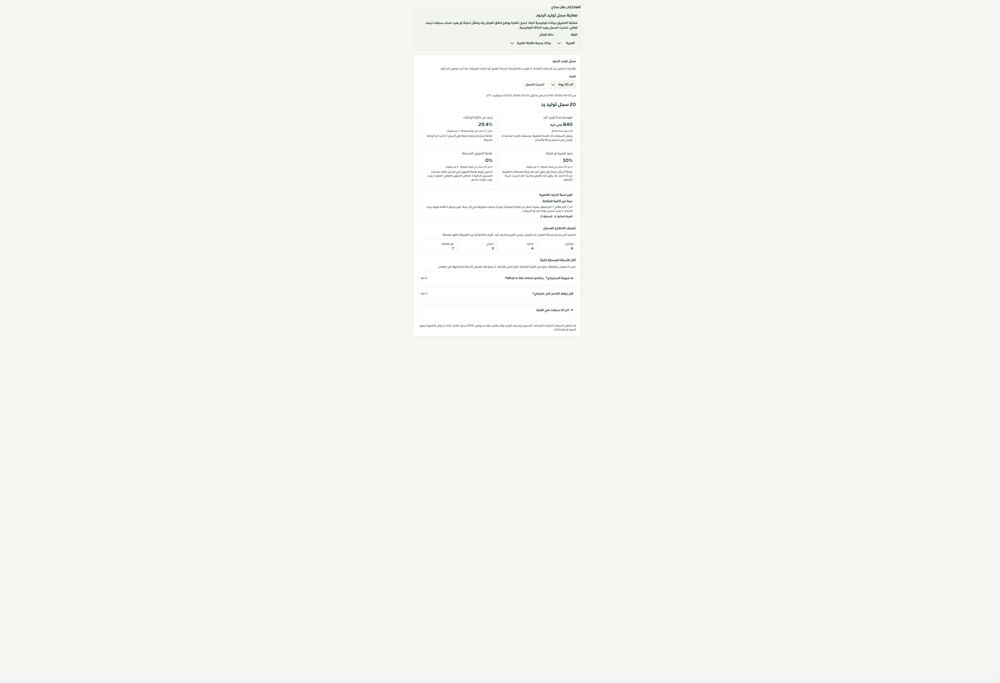
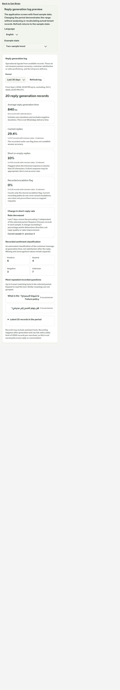
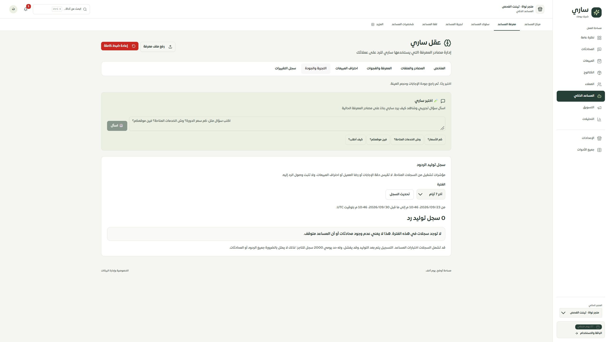

# دلالة سجل توليد الردود وموثوقية قراءته

1 أكتوبر2026 · المرحلة152 · main · تطبيق محلي وموك أب

استُبدلت بطاقة «الجودة» القديمة بسجل توليد الردود مع فترة7/30/90 يومًا وتحديث صريح، وأزيل إخفاؤها عند عدم توفر السجلات. هذه مؤشرات تشغيل وليست نسبة احتراف مبيعات أو رضا أو دليل تسليم.

## ما كشفه تتبع المصدر

`recordMetric` يُستدعى بعد التوليد أو استعادة إجابة مخزنة، بصورة غير متزامنة وقابلة للفشل. له حد2000 سجل يوميًا. علامة `was_empty` تعني ردًا أقل من10 أحرف بعد trim، وليست معيار صحة. `was_escalated` لا يمررها أي من مسارات التسجيل الحالية؛ لا يصح تفسير صفرها على أنه عدم وجود تحويلات. الانطباع آلي عند التوليد، وليس تقييم العميل بعد الإجابة. لم نغيّر مسارات التوليد أو حد التسجيل أو منطق التحويل في هذه المرحلة.

## الإصلاح

- مصدر قراءة جديد في معاملة قراءة فقط بلقطة متسقة، مع تحقق صحيح لعدد الأيام والتيننت، وبداية فترة شاملة ونهاية مستبعدة بتوقيتUTC. استُبدلت استعلامات القراءة القديمة؛ بقية التسجيل والتقارير الأسبوعية محفوظة.
- غياب قاعدة البيانات أو فشل الاستعلام يرجع خطأ، لا أصفارًا أو اتجاهًا مستقرًا. خطأ API العام لا يكشف تفاصيل SQL.
- نسب العلامات تستخدم القيم المعروفة0/1، وتُعرض معها أعداد البسط والمقام والمجهول. متوسط الزمن يشمل صفرًا صالحًا ويستبعد السالب. الانطباع غير المعروف ظاهر منفصلًا.
- مقارنة آخر7 أيام بالأسبوع السابق منفصلة عن الفترة المختارة. العينة الأقل من5 قيم معروفة في أي أسبوع تظهر «غير كافية». حد5 نقاط مئوية محسوب دون خطأ الكسور العشرية عند الحد الفاصل.
- الأسئلة الأكثر تكرارًا تُجمع حسب النص المطابق حرفيًا مع العدد، ويمكن فتح النص كاملًا. آخر10 سجلات مقيدة بنفس الفترة، وتُعرض كمقتطفات80 حرفًا مع التاريخ، وليس محادثة كاملة.
- الواجهة تخفي البيانات السابقة أثناء التحديث أو عند فشله، وتعرض الفراغ الحقيقي. شرح معنى المؤشرات وحدودها ظاهر، وتصميمها وترجمتها متوافقان مع اللوحة.
- معاينة مرتبطة من عقل ساري تستخدم مكوّن التطبيق نفسه بست حالات: بيانات، تحميل، خطأ، فراغ، مجهول، مقارنة. البيانات ثابتة وتغيير الفترة توضيحي؛ لا يعيد حساب سجلات فعلية.

## التحقق

نجحت174 حالة معزولة (19 عقد/مصدر،8 واجهة،15 موك أب العقل،132 حصر وحفظ الخصائص) و5 حالاتMySQL. اختبارات القاعدة أنشأت تيننتين مؤقتين ثم نظفتهما، وأثبتت الفصل وحدود الوقت والمجهول وصفر الزمن والمطابقة الحرفية ومقارنة الأسبوعين. لا تغيير لبيانات التاجر الفعلية عبر هذه الاختبارات.

نجح فحص أنواع التطبيق والموك أب وبناؤهما، وفحص10647 استدعاء ترجمة و499 مفتاحًا ديناميكيًا بلا فقد أو اختلاف معاملات. ميزانية الحزمة ناجحة، مع تحذير ExcelJS السابق.

في التطبيق المحلي ظهرت حالة الفراغ وتغيرت الفترة إلى7 أيام. في الموك أب جُرب فشل القراءة والتحديث والمجهول والمقارنة والعربية والإنجليزية. العرض الفعلي480×844، وعرض الصفحة الداخلي450 يساوي عرض التمرير450. أعيد قياس المتصفح الافتراضي. اللقطات الضيقة تتضمن هامش أداة الالتقاط؛ لم يُقص بصمت.

الحصر126 مسارًا و321 ملفًا و2160 موضع تحكم، بلا فقد مسار أو رابط غير صالح. الأخطاء المفتوحة في الفحص الآلي125 موضعًا لا تعني125 خطأً مثبتًا؛ الحصر دليل تتبع وليس ضمان100%.

## التالي والحدود

تجربة المساعد المضمنة في عقل ساري ما زالت واجهة قديمة، ثم بقية سجل الصفحات. لا قياس مبيعات أو تشغيلLLM/واتساب، ولا نشر أو دفع. خادم الفحص3018 أعيد تشغيله مع حجب الشبكة الخارجية. Safari/iPhone الفعليان لم يُختبرا.

[المعاينة المحلية](http://127.0.0.1:4329/reply-quality.html)

