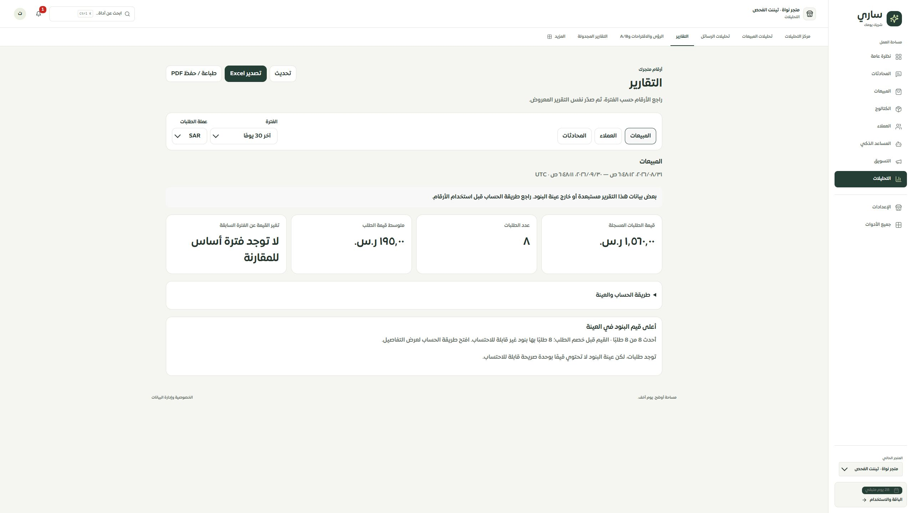

# المرحلة 70 — شاشة التقارير والتصدير من اللقطة المعروضة

استُبدلت شاشة Reports بمساحة عمل مشتركة تعزل التركيب بالمستخدم والتاجر المؤكدين. تقرأ نوع التقرير المختار فقط عبر reports.workspace بدل تشغيل ثلاث قراءات مع كل تغيير. تستخدم الشاشة والنسخة المطبوعة ومحتوى Excel وثيقة واحدة من اللقطة نفسها.

## التصميم والسلوك

- ملخص من ثلاث أو أربع بطاقات، وتبويبات الأنواع الثلاثة، والفترات الأربع، وSAR/USD للمبيعات. نطاق القراءة الفعلي بالتاريخ والثانية وUTC ظاهر دائمًا.
- تفاصيل التعريف والمقارنة والدفع المسجل والعينات في «طريقة الحساب والعينة». يبقى تنبيه الاستبعاد وحد العينة ظاهرًا قبل التفاصيل، ولا توصف البنود المجهولة بأنها غياب طلبات.
- جدول البنود يحافظ على القيم والكمية والاسم، وجدول العملاء يحتفظ بمعرف المحادثة والهاتف والعداد والقيمة القديمة ووحدتها المجهولة. الصفوف نصوص مهروبة وليست HTML أو صيغ Excel.
- التحميل والتحديث والاتصال الموقوف والفشل ومنع الصلاحية وانتهاء الجلسة مستقلة عن الفراغ الحقيقي. تُرفض اللقطة التي لا تطابق التاجر أو النوع أو الفترة أو العملة أو عقد البيانات، ولا تبقى الشاشة في تحميل بلا نهاية بسبب لقطة فاسدة.
- التصدير من التقرير المعروض دون قراءة أرقام جديدة. تُلغى نتيجة التجهيز المتأخرة عند تغير التاجر أو الاختيار أو اللغة أو تحديث البيانات، وتُمنع البداية المكررة. رابط التنزيل يُضاف للوثيقة ثم يزال ويحرر عنوان Blob.
- الطباعة تلتقط الوثيقة المراجعة وتفتح تفاصيل المصدر فيها. تلغى قبل الفتح إذا تغير النطاق، ويزال محتواها بعد حدث afterprint أو مغادرة الشاشة. Excel يتضمن طريقة الحساب والاستبعاد وسبب عدم توفر الجدول، وليس عنوانًا فارغًا يوحي بغياب القياس.

## التحقق

- 55 حالة ناجحة للواجهة والمصدر والتصدير، تشمل إلغاء الملفات المتأخرة عند تغير العملة واللغة والتاجر والتحديث، فشل التجهيز، الطباعة وتنظيفها، النصوص العدائية، الهواتف ذات الصفر الأول، والنسب ذات المقام المفقود.
- TypeScript وفحص الترجمة نجحا. فحص الترجمة شمل 9576 استدعاء و443 مفتاحًا ديناميكيًا دون مفقود أو خطأ استبدال. بناء التطبيق والخادم والعامل نجح.
- شُغّل الخادم المحلي بالمصدر الجديد خلف حاجز الاتصالات الخارجية، وفُحصت الأنواع الثلاثة وتغيير الفترة وفتح طريقة الحساب على تيننت الفحص. أظهرت عينة المبيعات 8 طلبات بقيمة1560SAR، وصرحت بأن بنودها القديمة بلا وحدة قابلة للاحتساب.
- فحص IAB المكتبي والعرض الضيق: viewport فعلي480، عرض الوثيقة450 وتمريرها450؛ أزرار وحقول وملخص التفاصيل46px وخطها16px. حُفظت صورة سطح المكتب وصورة العرض الضيق؛ يضيف التقاط IAB مساحة فارغة حول مساحة العرض المصغرة. أُعيد المقاس الافتراضي بعد الفحص.
- زر Excel الحي أنهى التجهيز وأظهر بدء التنزيل دون أخطاء console. لم يرجع متصفح IAB مسار ملف أو حدث تنزيل، حتى بعد اكتمال تحميل المكتبة وإعادة المحاولة؛ **حفظ الملف على القرص غير مثبت**. تدوير ملف Excel الفعلي وقراءة نصوصه مثبت باختبار المكتبة. الطباعة اختُبرت بالمحاكاة، لا بحوار Safari أو جهاز iPhone.

## التالي والحدود

المرحلة التالية موك أب تفاعلي يستخدم ReportsWorkspace نفسه مع الحالات والعينات والنوع والفترة والعملة والتصدير. لم تُرقَّ تغطية المسار من «موك أب عام» قبل اكتمال هذه المطابقة. Safari/iPhone الحقيقي، عرضا320/390 الفعليان، وحفظ تنزيل المتصفح والطباعة الفعلية ما زالت مفتوحة. لا نشر ولا تعديل بيانات إنتاج.
