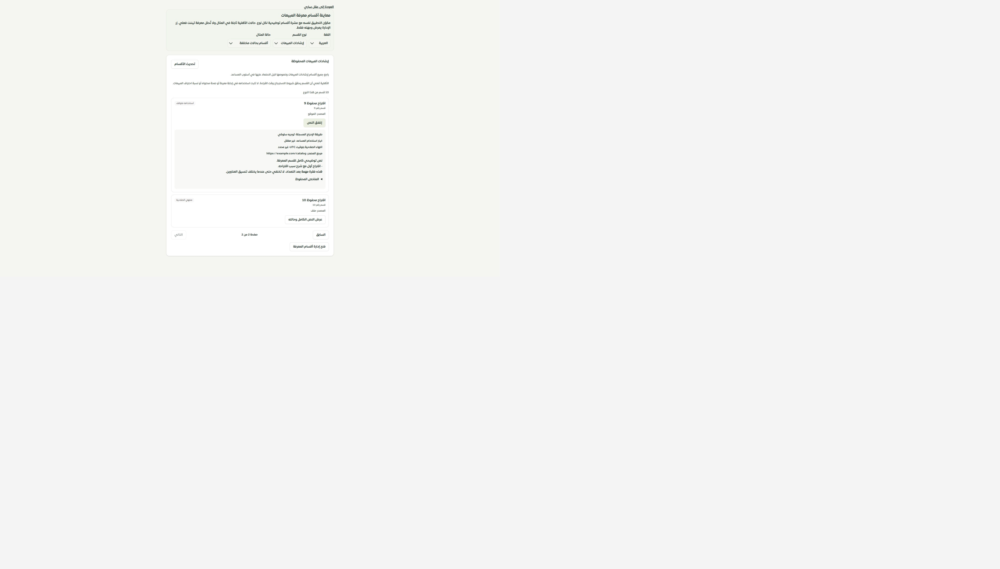
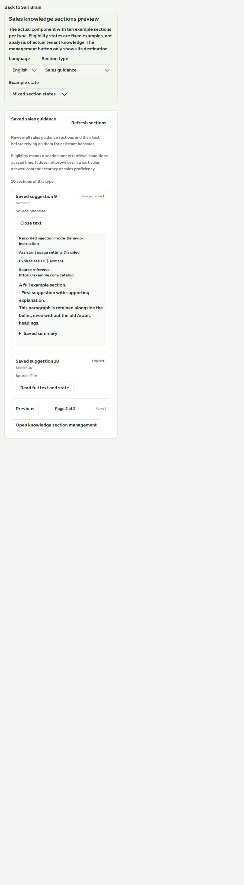
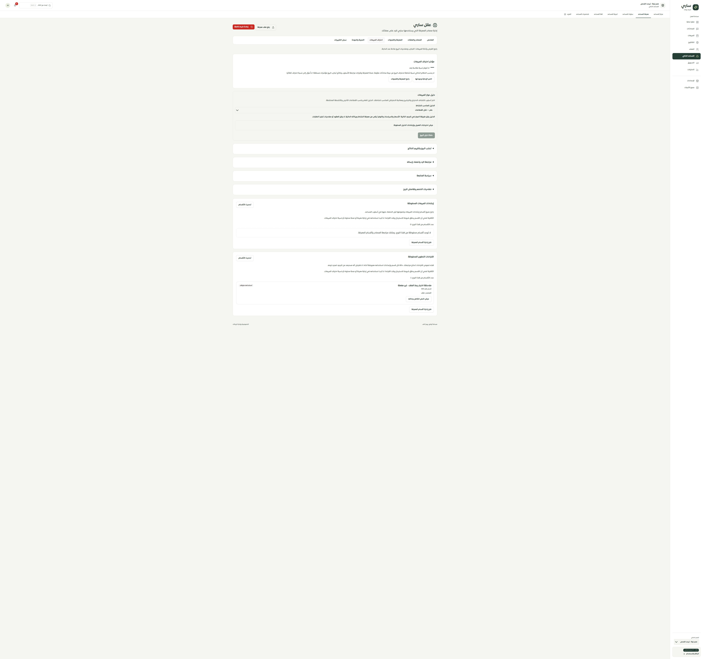

# نتائج معرفة المبيعات واقتراحات التطوير

1 أكتوبر2026 · المرحلة155 · main

استُبدلت بطاقتا المبيعات والتطوير القديمتان داخل عقل ساري بقراءة لجميع الأقسام المحفوظة مع الحالة والنص الكامل والترقيم. كان العرض القديم يختار أول قسم فقط ويستخرج بعض التعدادات بنمط عناوين عربية ثابت، وقد يخفي الفقرات أو الأقسام الأخرى. كما كان يخفي فشل القراءة ويؤكد الاستخدام التلقائي أو عدم الظهور للعميل دون عرض حالة القسم.

- تستخدم البطاقات الآن `sectionWorkspace` و`sectionReview` القائمتين على التيننت المؤكد وقراءة الأهلية المتحققة. تقرأ كل نوع منفصلًا، ثمانية أقسام في الصفحة، والنص عند فتحه فقط. تجدد القراءة عند فتح الشاشة أو النص ولا تعتمد مهلة التخزين العامة ذات الدقيقتين.
- حالات مؤهل للاسترجاع، مصدر غير متحقق، بانتظار المراجعة، استخدام متوقف، منتهي الصلاحية، ومستبعد ظاهرة. الأهلية ليست دليل استخدام في إجابة أو صحة معرفة أو احتراف مبيعات.
- النص الكامل محفوظ في العرض دون تحليل التعدادات أو القص. يرافقه مصدره، خيار الاستخدام، طريقة الإدراج، انتهاء الصلاحية ومرجع المصدر والملخص الاختياري. النص والمرجع يعرضان كنص آمن دون تفسير HTML أو تشغيل رابط من المصدر.
- القراءة المتعثرة تخفي النتيجة السابقة وتعرض إعادة المحاولة. النص ذو رقم أو نوع مختلف عن القسم المختار لا يعرض. حالة الفراغ الناجح منفصلة عن عدم القراءة والفشل.
- تُستخدم حالة التفاصيل الحديثة بدل حالة القائمة الأقدم عند فتح القسم. العودة لإدارة المعرفة تفتح الشاشة الحالية، ولا تقدم زر تفعيل سريعًا يتجاوز مراجعتها.
- أزيل استهلاك `getKnowledgeSections` من الواجهة، مع بقاء API مسجلًا. وُثق الانتقال في `api-transitions.json` وربط باختبارات البديل، دون تغيير خط أساس28 سبتمبر.
- موك أب مستقل يستخدم المكوّن الفعلي مع عشرة أقسام لكل نوع وست حالات للقراءة. بياناته توضيحية؛ زر الإدارة يعرض الوجهة ولا يعدل متجرًا.

نجحت **69 حالة** للقراءة والواجهة والصلاحيات وإدارة الأقسام وموك أب العقل. اختبار حفظ الخصائص رصد أولًا غياب توثيق انتقال API؛ بعد تسجيل البديل وأدلته نجحت **132 حالة** للحصر والحفظ. نجح فحص الأنواع للتطبيق والموك أب وبناؤهما، و10719 استدعاء ترجمة و515 مفتاحًا ديناميكيًا دون فقد أو أخطاء معاملات. ميزانية الحزمة ناجحة وتحذير ExcelJS السابق مستمر.

جُرب في المتصفح الانتقال إلى الصفحة الثانية وقراءة القسم التاسع كاملًا، وفشل النص ثم إعادة قراءته، والإنجليزية عند480×844 دون تجاوز أفقي (عرض داخلي450 وتمرير450). أعيد قياس المتصفح الافتراضي. في التطبيق المحلي فُتحت شاشة المبيعات لقراءة الأقسام. لا كتابة في قاعدة البيانات أو توليد AI، ولا دفع أو نشر. Safari/iPhone الفعليان لم يُختبرا.

الحصر126 مسارًا و323 ملفًا و2170 موضع تحكم بلا مسارات محذوفة أو روابط غير صالحة. التالي مراجعة بقية البطاقات القديمة وإجراءات المصادر وإعادة الضبط داخل عقل ساري، ثم بقية سجل الصفحات.

التحقق المحلي أظهر صفر أقسام إرشادات مبيعات واقتراح تطوير واحدًا (885) من ملف. فتحه أكد أنه متوقف، وخيار استخدام المساعد غير مفعّل، وطريقة الإدراج «دون إدراج»، وأظهر النص المحفوظ كاملًا دون تغيير القسم.

[الموك أب المحلي](http://127.0.0.1:4329/sales-knowledge.html)

