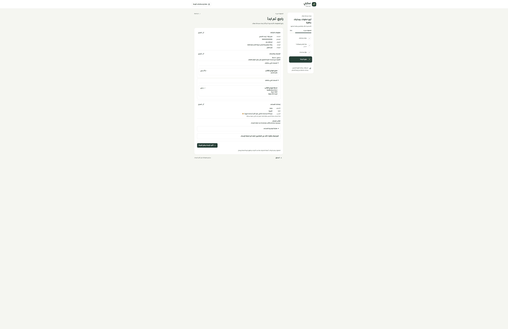

# مراجعة واعتماد إعداد التيننت والمسودة

المرحلة 144 — 2026-09-30، محلي على main، دون نشر.

## ما تغير

أصبح API والشاشة يستخدمان المصدر الذري في المرحلة 143. تعرض المراجعة معلومات النشاط والأسعار والعملات والوصف والروابط وفئة الخدمة ومدتها ورسالة المساعد والأوقات. يفحص زر المراجعة البيانات الحالية، ثم يعتمد التاجر الاختيارات، وتظهر نتيجة مؤكدة بإيصال وتقدم 100% بدل انتقال يخفي النتيجة.

- رقم الطلب ومحتواه محفوظان في sessionStorage بنطاق المستخدم والتيننت، ويتحقق العميل من محتوى الإيصال. بعد فقد الرد أو تحديث الصفحة يمكن قراءة الإيصال أو إعادة الطلب نفسه. يمسح تسجيل الخروج هذا التخزين وتُرفض كتابات الجلسة السابقة.
- لا يُعرض فشل تحديث ذاكرة الشاشة بوصفه فشلًا لحفظ أكده الإيصال.
- قراءة المسودة لا تنشئ صفوفًا. حفظها مشروط ببصمة النسخة الحالية مع رقم مراجعة؛ يحفظ القيم غير المكتملة كما هي ويمنع تجاوز مسودة أخرى أو إعادة فتح إعداد مكتمل.
- إعادة البداية تعرض أثر الاستبدال، وتقرأ البصمة، وتحدث علامات الإعداد والمسودة في معاملة واحدة. تبقى البيانات الفعلية محفوظة، وتبدأ المسودة من معلومات المتجر الحالية.
- أزيلت دوال الكتابة القديمة غير المستهلكة، وبقي قارئ حالة الإعداد المستخدم في صفحة التاجر.
- أعيدت كتابة اختبارات الويزرد القديمة التي كانت تنشئ بيانات دون تنظيف لتستخدم حسابات اختبار مؤقتة، مع اختبارات API والعزل والتخزين بدل الادعاء بحماية مبنية على مطابقة نص الكود فقط.
- بقيت جميع مفاتيح الترجمة القديمة، وأضيفت نصوص المراجعة والاستعادة بالعربية والإنجليزية.

## الأدلة

- 273 حالة مميزة ضمن رجعية مكونات الإعداد وحصر الخصائص. كشف فحص الحصر اختلاف بصمة بعد التنسيق؛ أُعيد توليده ثم نجح فحص الحصر والواجهة (148 حالة ضمن العدد السابق).
- 36 حالة MySQL: 26 للاعتماد و10 للمسودة وإعادة البداية. شملت التزامن والتعارض والعزل والبيانات التالفة وحد بايتات Unicode والتراجع عند فشل الحفظ.
- الأنواع والبناء ومفاتيح الترجمة ناجحة؛ 10375 استدعاء ترجمة و476 مفتاحًا ديناميكيًا بلا فقد أو أخطاء استيفاء.
- تجربة فعلية على تيننت الفحص المحلي: إعادة البداية من الإعدادات، حفظ مراحل النشاط والقالب والمساعد، مراجعة واعتماد منتج بسعر25SAR وخدمة مجانية مدتها90 دقيقة. الإيصال `03b2133e-5967-4e8d-80ec-e79f634b63be` استعيد بعد تحديث الصفحة دون إرسال الحفظ مرة أخرى.
- قاعدة البيانات: المنتجات9→10، الخدمات0→1، إيصال واحد، استخدام القالب0→1. جميع صفوف المنتجات التسعة السابقة بقيت مطابقة تمامًا. لم يُغيّر الاعتماد مفاتيح تشغيل الرد الآلي السابقة؛ الرد الآلي على مستوى التاجر بقي متوقفًا.
- العرض الفعلي المكتبي2560×1440 (عرض المستند2530)، والضيق480×844 (عرض المستند450)، بلا تجاوز أفقي. لقطة العرض الضيق اقتصت هامش الالتقاط الفارغ الذي يعيده المتصفح. هذه ليست تجربة Safari أو iPhone فعليًا.

## المتابعة المباشرة

إكمال تجربة حل تعارض المسودة مع حفظ نسخة محلية واستعادة التعديلات، ومعالجة الخيارات غير الصالحة/المتقاعدة في المراجعة، ثم مراجعة دمج اقتراحات الموقع وحقول النشاط والمساعد ومطابقة الموك أب. فحص بقية صفحات النظام وSafari/iPhone الفعلي ما زال في سجل الاستكمال؛ لا ادعاء بتغطية100%.

الحصر الحالي126 مسارًا و314 ملفًا و2120 عنصر تحكم؛ لا روابط مكسورة أو ملفات يتيمة في هذا الحصر. التغطية التفصيلية لكل المسارات لم تكتمل.
