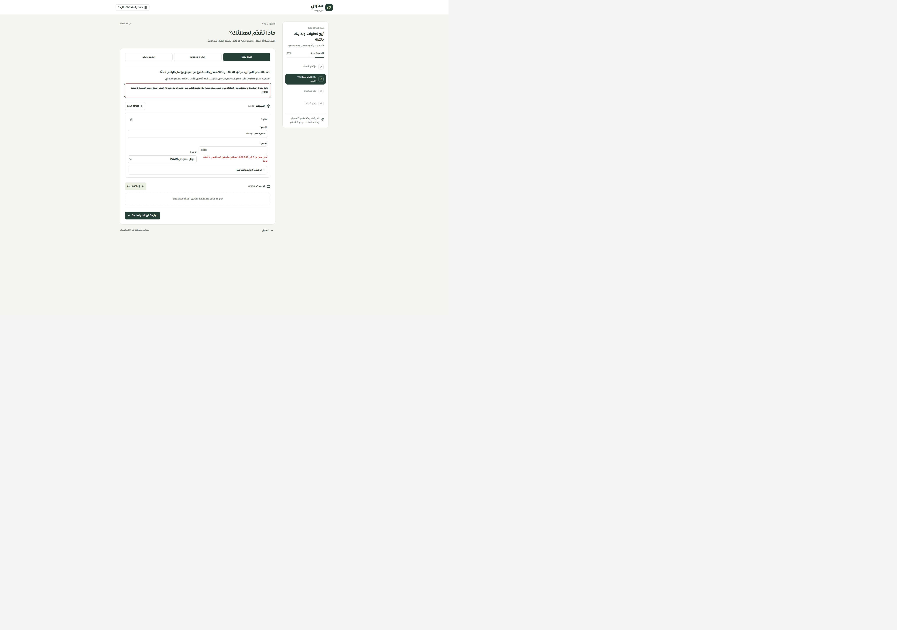
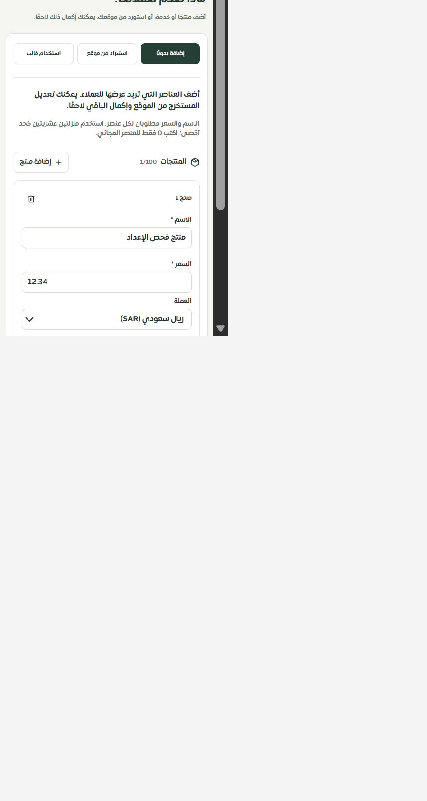

# المرحلة140 — إدخال كتالوج الإعداد

2026-09-30، main محلي، دون نشر أو اعتماد نهائي لحساب الفحص.

استُبدلت بطاقات المنتجات المستخرجة غير القابلة للتحرير بنموذج مشترك لكل العناصر: الاسم والسعر والعملة في المقدمة، والوصف والفئة وروابط المنتج والصورة ضمن التفاصيل. تظهر الأخطاء بجانب الحقول بعد مغادرتها أو محاولة المتابعة، وتفتح التفاصيل المحتوية على خطأ. السعر يدعم لوحة الأرقام العشرية دون تقريب أو تصفير.

الصف الناقص يبقى في المسودة. العناصر التي سبق إدخالها قبل تغيير نوع النشاط تبقى مرئية مع توضيح. المجموعات والصفوف التالفة تظهر مع أصلها وإزالة صريحة قابلة للتراجع. تعديل صف لا يغيّر صفًا آخر له المعرّف القديم نفسه. حد الإضافة100 لكل مجموعة؛ تبقى الصفوف الزائدة القديمة مرئية حتى إصلاحها. جميع نصوص المكوّن عربية/إنجليزية.

## التحقق

-71حالة ناجحة للنموذج وعقد الأسعار والمراجعة والتنقل؛ تشمل صفًا مستخرجًا دون سعر، بيانات تالفة، عملة، روابط، الإزالة والاسترجاع دون تغيير المصفوفة الأصلية أو فقد تعديل لاحق، والإنجليزية.
-132حالة لحصر الخصائص. الحصر126مسارًا و312ملفًا و2106عناصر، بلا روابط غير صالحة أو مسارات محذوفة.
-الأنواع والترجمة والبناء ناجحة؛10311مفتاحًا مباشرًا و459ديناميكيًا بلا نقص.
-التجربة الفعلية على3018: إضافة «منتج فحص الإعداد»، منع سعر فارغ برسالة مرتبطة بالحقل، تصحيحه12.34، الانتقال إلى المساعد ثم العودة مع بقاء القيمة وحالة «تم الحفظ».
-قياس العرض المكتبي2560دون تجاوز. العرض الضيق الفعلي480×844، محتوى الوثيقة450وعرض الحقول358. أصلح محاذاة السعر والعملة عند ظهور خطأ. جرى إعادة حجم المتصفح الافتراضي بعد القياس. هذا ليس إثبات Safari/iPhone أو320/390.

## التالي

معالجة أسعار استخراج الموقع وبياناته قبل دخول المسودة، ثم تحويل القوالب إلى اقتراح قابل للمراجعة، وحفظ نهائي ذري واستعادة نتيجة وإصدارات للمسودة، والموك أب المطابق. بقية السجل مفتوحة.

