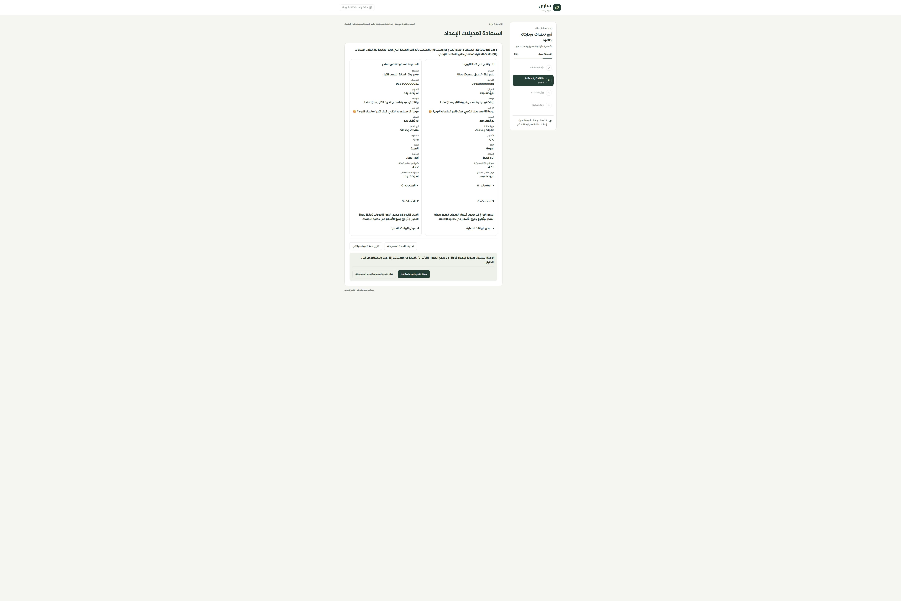

# استعادة مسودة إعداد التيننت وحل التعارض

المرحلة 145 — 2026-10-01. محلي على main، دون نشر أو تغيير قاعدة البيانات.

## الإصلاح

تُحفظ التعديلات الخام فورًا في sessionStorage بنطاق الحساب والمتجر قبل انتظار الحفظ. تشمل النسخة المرحلة والحقول والكتالوج غير المكتمل؛ لا تتحول الأسعار الفارغة إلى صفر. عمر النسخة مرتبط بالتبويب وجلسة المتصفح؛ ليست نسخة دائمة بعد إغلاق المتصفح.

تظهر المقارنة عند استعادة تعديلات غير محفوظة أو تعارض تبويبين. يستطيع التاجر تنزيل نسخة، أو اختيار كامل تعديلاته، أو تركها لصالح المسودة المحفوظة. لا دمج تلقائي للحقول ولا اعتماد تلقائي للإعداد. إذا اكتمل الإعداد في مكان آخر، تبقى النسخة قابلة للتنزيل ولا تعيد فتح المتجر. البيانات غير المقروءة لا تُستبدل تلقائيًا.

تُلغى الطلبات المنتظرة بعد التعارض، وينتظر الاختيار انتهاء الطلب السابق. تُستخدم بصمة النسخة المعروضة عند حفظ الاختيار المحلي؛ يظل التعارض اللاحق محميًا. تأكيد حفظ قديم لا يمسح نسخة أحدث. تسجيل الخروج يمسح النسخ ويمنع كتابات الجلسة السابقة. يتنبه المتصفح قبل مغادرة تغييرات غير مؤكدة.

كشفت التجربة الفعلية أن fetch يستخدم ذاكرة React Query لمدة دقيقتين. أُجبرت قراءة المسودة وإيصال الاعتماد عند الاستعادة على staleTime=0؛ المقارنة الآن تقرأ أحدث نسخة. لا يُعرض فشل الحفظ أو التخزين مع تفاصيل داخلية.

## التحقق

- 221 حالة رجعية ناجحة: الاستعادة والعزل والتعارض المتكرر وإلغاء الطابور والإيصال والكتالوج والقوالب وحصر الخصائص. تشمل 40 حالة في حزمة المسودات والواجهة واستعادة الاعتماد.
- TypeScript والبناء وفحص الترجمة ناجحة. 10438 استدعاء و480 مفتاحًا ديناميكيًا. لا مفاتيح مفقودة أو استيفاء غير صالح.
- تجربة فعلية في تيننت الفحص المحلي بتبويبين: حفظ اسم بالمسودة الأولى، منع الثانية من الكتابة فوقه، عرض النسختين، استعادتهما بعد reload، اختيار النسخة المحلية وحفظها، ثم reload دون مطالبة متكررة.
- فحص ضيق بعرض DOM 480×844، وعرض مستند450 بدون تجاوز أفقي. اقتصت اللقطة هامش الالتقاط الفارغ الخاص بمتصفح الفحص. ليست تجربة Safari أو iPhone فعليًا.
- الحصر:126 مسارًا،316 ملفًا،2127 عنصرًا، ولا روابط غير صالحة أو ملفات يتيمة في الحصر. التغطية التفصيلية لجميع المسارات لم تكتمل.

## المرحلة التالية

مراجعة اقتراحات الموقع: منع استبدال المنتجات تلقائيًا وقص الصفوف الزائدة، توضيح الأسعار غير المؤكدة واختيار الدمج/الاستبدال/التجاوز، ومنع اقتراح ملف نشاط قديم أو غير صالح. ثم حقول النشاط والمساعد والخيارات المتقاعدة ومطابقة الموك أب وبقية سجل الفحص.
