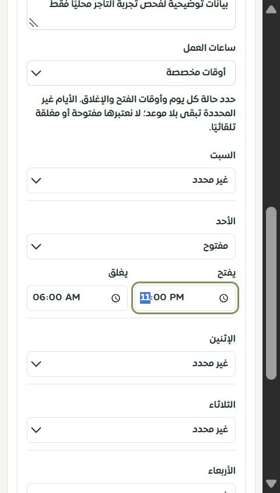
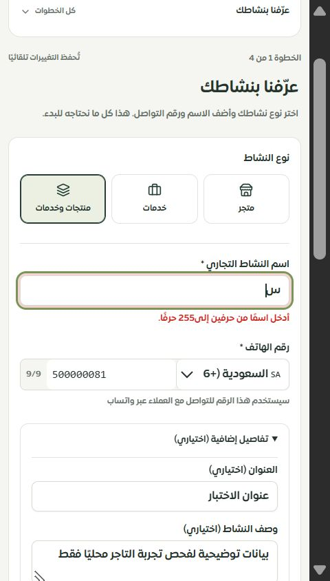

# إصلاح حقول النشاط والمساعد والأوقات

المرحلة147 — 2026-10-01. محلي على main، دون نشر.

## الإصلاح

أصبحت حقول النشاط تعتمد مباشرة على المسودة، بدل نسخة داخلية قد تستبدل تغييرًا أحدث من خطوة أخرى. تستخدم الفحوص عقد الاعتماد المشترك للأسماء والأرقام والعناوين والأوصاف والأوقات. يظهر الخطأ عند الحقل، وتُفتح التفاصيل الاختيارية عند محاولة المتابعة ببيانات غير صالحة. القيم القديمة التي ليست نصًا تُعرض بصيغتها الأصلية مع إجراء صريح لمسحها؛ لا تسبب انهيار الحقول ولا تختفي تلقائيًا.

أضيف محرر الأوقات المخصصة للأيام السبعة، مع حالات غير محدد/مفتوح/مغلق ومدخلات وقت أصلية مناسبة للموبايل. يظل اليوم غير المحدد غير موجود في بيانات الجدول، وتبقى الأوقات التي تمتد عبر منتصف الليل كما أدخلها التاجر. الأوقات غير القابلة للتحرير تتطلب إعادة إدخال صريحة. هذا محرر بيانات النشاط؛ لم يُختبر في هذه المرحلة تشغيل الردود الآلية بحسب تلك المواعيد.

تتحقق معاينة المساعد من الكتالوج واللغة والأسلوب ورسالة الترحيب قبل عرضها. لا تستقبل صفوفًا تالفة ولا تعرض أسعارًا محوّلة خطأ. اللغات التي لا تدعمها المعاينة المحلية تعرض توضيحًا بدل محاكاة إنجليزية. تغيير لغة المساعد لم يعد يغيّر العملة داخل المسودة. تعرض رسالة الترحيب والأسلوب واللغة أخطاءها وتمنع المتابعة عند بقاء الخطأ.

تسمّي المراجعة الحقول التي تحتاج إصلاحًا وتعيد التاجر إلى قسمها، مع فتح حقل النشاط المقصود. يمكن الرجوع للإصلاح حتى إذا كانت علامات إتمام المراحل القديمة ناقصة. ويمكن إلغاء اختيار قالب متقاعد أو إزالة مرجع موقع غير صالح، مع الاحتفاظ بالمنتجات والخدمات المنسوخة في المسودة. لا تُعرض القيم غير المعروفة باعتبارها «ودود» أو «مفتوح دائمًا».

## التحقق

- 294 حالة رجعية ناجحة تشمل17 حالة جديدة لحقول النشاط والأوقات والمساعد وإزالة المراجع مع الحفاظ على البيانات.
- TypeScript والبناء والترجمة ناجحة. 10527 استدعاء و499 مفتاحًا ديناميكيًا دون فقد أو خطأ استيفاء.
- تجربة فعلية في الويزرد المحلي: إعداد الأحد23:00–06:00 والجمعة مغلقًا، إبقاء بقية الأيام غير محددة، اختبار اسم قصير وظهور خطئه ومنع الانتقال ثم إصلاحه، والمتابعة إلى المساعد واختيار الفرنسية مع توضيح حدود المعاينة.
- فحص العرض الضيق480×844 ومستند450 بلا تجاوز أفقي، وحقول الوقت الأصلية قابلة للتحرير. لا ادعاء باختبار Safari/iPhone حقيقيين.
- الحصر126 مسارًا و319 ملفًا و2150 عنصرًا؛ لا روابط غير صالحة أو ملفات يتيمة في الحصر. التغطية التفصيلية لكافة الصفحات ما زالت في سجل الاستكمال.

## التالي

مطابقة مراحل الويزرد الأربعة وكل حالات الموقع والقالب والتعارض والمراجعة والإيصال في الموك أب التفاعلي. متابعة استهلاك أوقات النشاط فعليًا، ومراجعة بقية صفحات لوحة التيننت وشخصيات العمل وعقل ساري وفق السجل الشامل. لم تُختبر مزودات مدفوعة أو تُرسل رسائل أو يُنفذ نشر.
