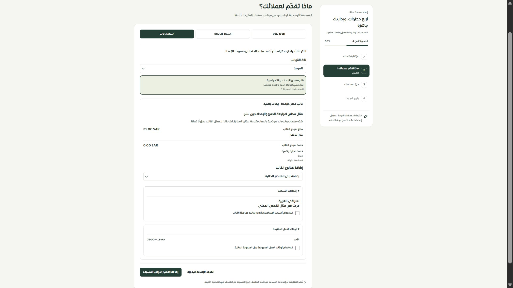

# المرحلة142 — القوالب كمراجعة ومسودة

2026-09-30، main محلي؛ لا نشر أو اتصال خارجي.

أزيل applyTemplate الذي كان ينشئ منتجات وخدمات ويعدّل الملف والمساعد قبل نهاية الإعداد. البديل previewTemplate قراءة فقط، يتحقق من مالك المتجر المختار ونشاط القالب ومحتواه وحدوده ويستخدم الترجمة المطلوبة. يعرض العميل محتوى القالب قبل اختيار دمج الكتالوج أو استبداله أو تركه، وتطبيق المساعد والأوقات اختياريان بصورة مستقلة. فتح القالب أو الرجوع عنه لا يغير المسودة.

أصبح الدمج يحافظ على الصفوف القديمة حتى الناقصة، ويحترم تعديلات عناصر القالب عند إضافته ثانيةً بمعرّفات مستقرة، ويمنع تجاوز100عنصرًا بدل إسقاط صفوف. الاستبدال اختيار واضح برسالة تبين ما سيُستبدل. البيانات التالفة تمنع الدمج. نُقلت مدة الخدمة وفئتها عبر المسودة والمراجعة والاعتماد، وأضيف تحريرهما وحدود المدة بدل فقدهما عند الانتقال من مسار القالب القديم.

الشاشة تعرض الاسم والوصف والفئة المناسبة والرمز والاستخدامات المسجلة، والعناصر وأسعارها ومددها، ورسالة المساعد وأسلوبه ولغته وأوقات العمل. حالات الفشل منفصلة عن عدم وجود قوالب، والمعاينة المخزنة لا تُعتمد أثناء فشل القراءة أو التحديث. أزيل ts-nocheck من المكوّن.

## التحقق

-82حالة ناجحة للعقود والواجهة وAPI وبقية تدفق الإعداد؛ تشمل منع الكتابات عند المعاينة، تقاعد API القديم، رفض حقول الطلب الزائدة والقالب غير النشط/التالف، الترجمة، الدمج المتكرر، الحدود، اختيار الحقول الاختيارية ومدد الخدمات.
-132حالة لحصر الخصائص. انتقال API موثق في api-transitions.json بدل تعديل خط أساس28سبتمبر. الحصر126مسارًا و313ملفًا و2111عنصرًا.
-الأنواع والترجمة والبناء ناجحة؛10343مباشرًا و459ديناميكيًا بلا نقص.
-تجربة المتصفح الفعلية3018 باستخدام قالب وهمي في sari_pages_test: معاينة منتج25ريالًا وخدمة مجانية90دقيقة، ثم دمجها مع منتج سابق12.34. بقي المنتج السابق في المسودة، وأضيف المنتج والخدمة فقط إلى المسودة.
-بصمة المنتجات والخدمات وملف المتجر وإعدادات المساعد وسجل القالب بقيت متطابقة قبل المعاينة وبعدها وبعد الدمج. الكتالوج الفعلي بقي9منتجات وصفر خدمات. لا اعتماد نهائي لحساب الفحص.
-عرض ضيق فعلي480×844، عرض الوثيقة450، لا تجاوز من أزرار/اختيارات القالب. أُعيد الحجم الافتراضي. لا إثباتSafari/iPhone أو320/390.

## التالي والحدود

الاعتماد النهائي ما زال يحتاج معاملة شاملة وإيصالًا ومنع التكرار؛ تسجيل استخدام القالب مرة واحدة ينتقل إلى هذا الاعتماد، ولا يزيد عند المعاينة أو إضافة المسودة. تبقى مراجعة الموقع وتعارض المسودات وإعادة الإعداد وملخص المراجعة الكامل والموك أب ضمن المراحل التالية. القوالب تعرض أمثلة ولا تثبت مخزونًا فعليًا؛ حقول مخزون الأمثلة لم يكن الكاتب القديم يحفظها ولم يُضف تفعيل تلقائي لها.

