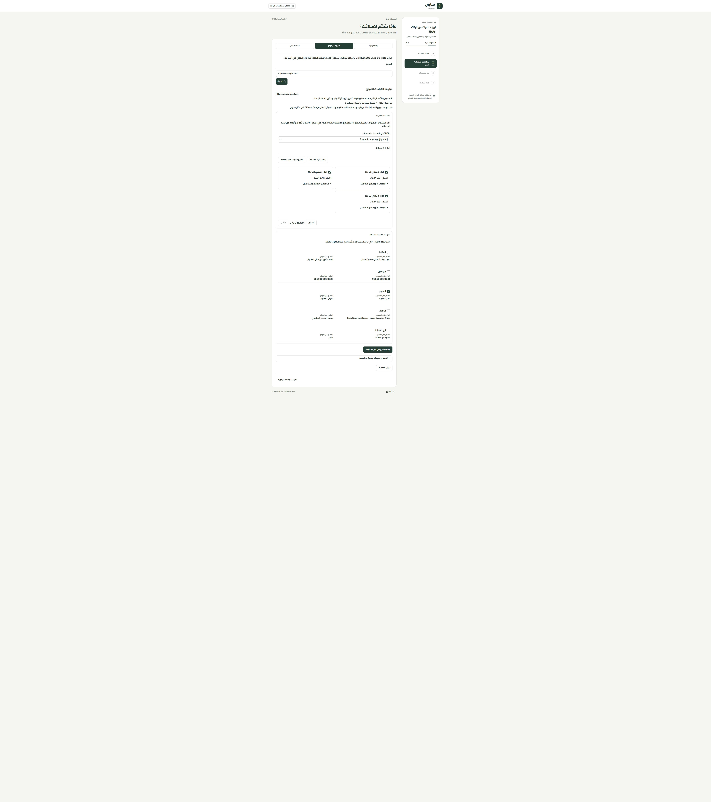
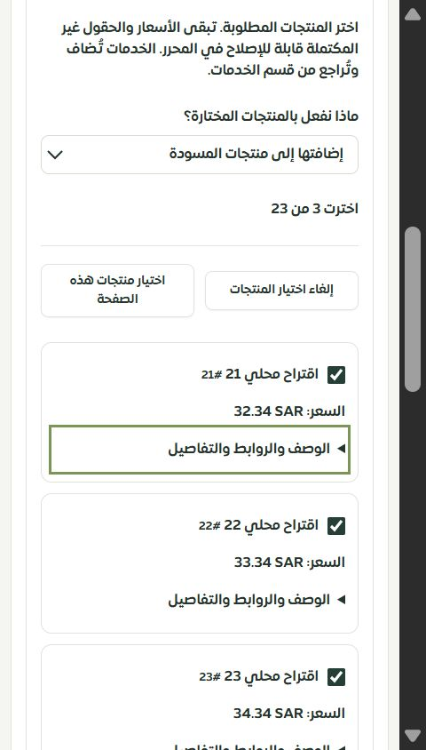

# مراجعة اقتراحات الموقع قبل إضافتها للإعداد

المرحلة146 — 2026-10-01. محلي على main، دون نشر أو استدعاء مزود خارجي.

## التغيير

أزيل استبدال منتجات المسودة فور انتهاء التحليل. تحفظ الشاشة الآن معاينة مستقلة، ثم يختار التاجر المنتجات وطريقة إضافتها: دمج، استبدال منتجات المسودة، أو الاحتفاظ بالمنتجات دون إضافة. لا تتغير الخدمات بهذه العملية. لكل حقل من معلومات النشاط اختيار مستقل مع عرض الحالي والمقترح؛ لا تُنقل كائنات الاقتراح المخزنة إلى ملف النشاط مباشرة.

لا تُقص القائمة عند100. تدعم المعاينة حتى500 اقتراح ضمن700 ألف بايت مع ترقيم20 عنصرًا واختيار صفحة أو صف وإلغاء الاختيار. ما زال حد الكتالوج100 لكل مجموعة؛ تعرض الشاشة سبب المنع عند تجاوز الحد. المعاينة التي تتجاوز السعة تُرفض بوضوح وتبقى المسودة السابقة. تُراجع سعة المسودة المجمعة قبل الإضافة.

تظل الأسعار الصفرية المستخرجة غير مؤكدة ولا تتحول تلقائيًا إلى منتجات مجانية. تُحفظ النصوص والأعداد وأرقام التواصل المعروضة دون قص صامت، وتُمنع الحقول غير الصالحة من استبدال الملف حتى يصلحها التاجر. الروابط والصور قابلة للفتح صراحة دون تحميل صور الموقع تلقائيًا.

يُحفظ مصدر المعاينة وهويتها واختياراتها في المسودة. تغيير الرابط يمنع إضافة نتيجة مصدر آخر. مغادرة الشاشة أو تغير جلسة الحساب يمنع تطبيق نتيجة متأخرة. لا تعيد الشاشة إرسال التحليل عند تحميل المعاينة المحفوظة، ولا تضيف المعاينة نفسها مرة ثانية بعد تطبيقها. أخطاء المزود مترجمة دون كشف تفاصيله الداخلية.

الأسئلة والصفحات وأرقام التواصل المستخرجة معلومات للمراجعة؛ لا تعتبر معرفة معتمدة للمساعد ولا جهات اتصال موثقة. صور القوالب والأسعار المستخرجة ليست دليلًا على المخزون. استخراج الموقع نفسه ما زال يستخدم محللات الأسعار السابقة؛ لا يدعي هذا التغيير التحقق من صحة المصدر أو تحويل كل خدمات الموقع تلقائيًا.

## الأدلة

- 285 حالة رجعية ناجحة تشمل50 حالة لمراجعة الموقع وأسعاره، إضافة إلى الويزرد والمسودات والقوالب والكتالوج وحصر الخصائص.
- TypeScript والبناء ناجحان. الترجمة:10479 استدعاء و492 مفتاحًا ديناميكيًا؛ صفر مفاتيح مفقودة أو أخطاء استيفاء.
- تجربة حقيقية للشاشة على تيننت الفحص باستخدام معاينة وهمية من23 منتجًا، دون اتصال example.test أو LLM. اختيرت المنتجات21–23 وحقل العنوان. بعد الإضافة:4 منتجات في المسودة (اليدوي+3 مختارة)، وخدمة واحدة محفوظة، والاسم الأصلي بقي كما هو.
- مقارنة جميع حقول صف التاجر ومنتجاته العشرة وخدمته الفعلية قبل التجربة وبعدها أثبتت تطابقها. لم يُنفذ اعتماد الإعداد في هذه التجربة.
- عرض ضيق DOM480×844، مستند450 بلا تجاوز أفقي، وعرض مكتبي. ليست تجربة Safari أو iPhone فعليًا.
- الحصر:126 مسارًا و317 ملفًا و2136 عنصرًا. لا روابط غير صالحة أو ملفات يتيمة في الحصر؛ لا ادعاء باكتمال المراجعة التفصيلية لكل الصفحات.

## التالي

إصلاح الحقول الخام غير الصالحة في معلومات النشاط والمساعد، إضافة تحرير الأوقات المخصصة، توجيه أخطاء المراجعة للحقول الدقيقة، وإلغاء الاختيارات المتقاعدة. ثم مطابقة الويزرد في الموك أب وبقية سجل الفحص.
