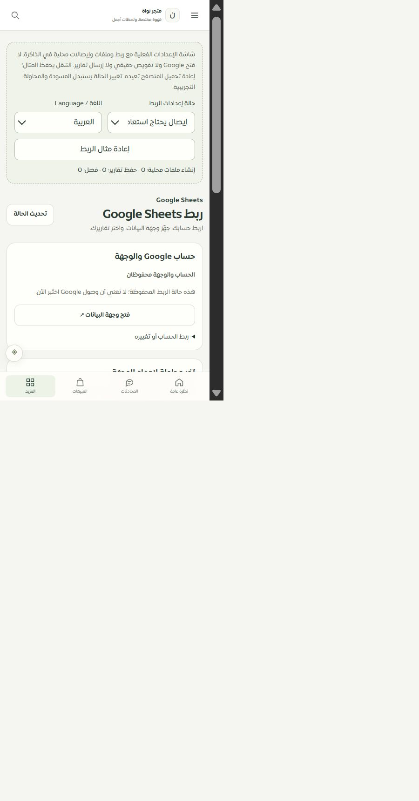

# موك أب إعدادات Sheets المطابق — 2026-09-30

يعرض مسار `/merchant/sheets/settings` المكوّن الفعلي `SheetsSettingsWorkspace` وترجماته، بدل نموذج التكامل العام. يحاكي22 حالة: الربط والوجهة، عدم الصلاحية والجلسة والقراءة، الإنشاء وفقد رده، إيصال يحتاج اعتمادًا، نتيجة غير مؤكدة، اتصال تغيّر، إيصال سابق، الحفظ والفصل وردهما غير المؤكد.

اختيار الحساب داخل المحاكاة لا يفتح Google. فتح الوجهة أو ملف المحاولة يعرض أوراق القالب الأربع وعناوينها نفسها محليًا، وينقل التركيز إلى المعاينة ويعيده عند إغلاقها. تستمر المحاولة والنتيجة في الذاكرة أثناء التنقل؛ إعادة تحميل المتصفح تعيد المثال، بخلاف سجل الخادم الفعلي الدائم. لا تُمثل بصمات المثال حماية أمنية.

82/82 حالة لنموذج الإعدادات والنسخة المبنية ومكوّن التطبيق وموك أب التصدير. تثبت الاختبارات منع الشبكة في الموك أب، الربط الصريح، موافقات الإنشاء والتقارير والفصل، فقد الرد، الاستعادة دون إعادة إنشاء، وإيقاف الأزرار في حالات القراءة غير الصالحة. نجح فحص TypeScript للتطبيق وللموك أب وبناء حزمته.

في المتصفح جُرّبت استعادة ملف محفوظ وفتحه وظهرت الأوراق الأربع دون زيادة عدد الإنشاءات؛ العرض الفعلي480×860 دون تجاوز أفقي. لقطة العرض الصغير مرفقة. Safari/iPhone ومقاسات320/390 لم تُختبر فعليًا. لا OAuth حقيقي أو إنشاء Google أو إرسال WhatsApp أو نشر.

الحصر ما زال126 مسارًا و306 ملفات و2039 عنصرًا. تصنيف التصميم74 عامة و35 جزئية و9 تفصيلية و8 تحويلات؛ الانتقال إلى جزئي يعكس مطابقة المكوّن وتجربة الحالات المحلية، لا اكتمال جميع الاختبارات الخارجية.

نجحت132/132 حالة حفظ الخصائص والحصر، وبناء التطبيق مع تحذير ExcelJS المعروف ودون تجاوز ميزانية الحزمة الرئيسية.
