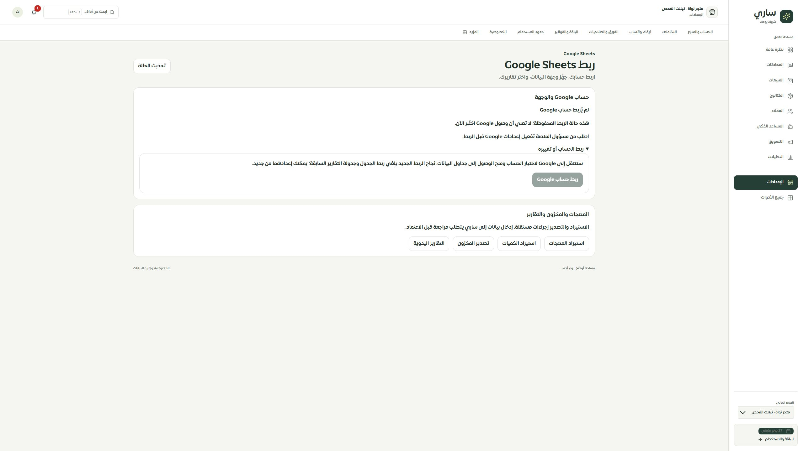

# شاشة إعدادات Google Sheets — 2026-09-30

استُبدلت الشاشة القديمة بمكوّن مساحة العمل الجديدة، مع ربط الحساب وإنشاء الوجهة والتقارير والفصل واستعادة محاولة الإنشاء. تتطابق القراءة والكتابة مع التيننت والمستخدم وبصمة الإعدادات، وتمنع الشاشة الإجراءات عند فشل القراءة أو فقد الصلاحية أو الاتصال.

- لا يبدأ تفويض Google أو إنشاء ملف تلقائيًا. إنشاء الوجهة يحتاج مراجعة صريحة، وتعرض المحاولة المحفوظة وإيصالها وخيار الاستعادة دون إعادة إنشاء.
- خيارات التقارير مسودة بثلاثة اختيارات وزر حفظ واحد؛ تغير المصدر أثناء التحرير يوقف الحفظ ويتيح تحميل القيم المحفوظة.
- الفصل له مراجعة واضحة، ويُفحص الرد للتأكد من إلغاء الربط والتقارير. رد غير صالح أو مفقود يتطلب تحديث الحالة قبل إجراء آخر.
- لا يُعرض اتصال مخزن بوصفه اختبار وصول حي إلى Google. يظهر رابط ملف المحاولة الأصلية منفصلًا عن الوجهة الحالية عند اختلافهما.
- حُفظت روابط استيراد المنتجات والكميات وتصدير المخزون والتقارير اليدوية. أزيل استهلاك العميل لـ `getReportSettings` و`setupSpreadsheet` لصالح القراءة الموحدة وسجل المحاولات؛ إزالة الخادم القديم مرحلة تالية.

## دليل التحقق

37 حالة لتفاعل الشاشة وردودها، تشمل العربية والإنجليزية، القراءة المرفوضة، النطاق الخاطئ، الاستجابة المتأخرة بعد الخروج، خيارات التقارير، الفصل، الموافقة، المحاولات المفتوحة والاستعادة. أُضيف تحقق للعقد يرفض إيصال الإنشاء المفقود أو المختلف عن هوية المحاولة.

عُرض التطبيق الفعلي محليًا على التيننت التجريبي بحالة غير مرتبطة وتعطيل إعداد OAuth. فُحص 2560×1440 و480×844 دون تمرير أفقي ومع عنوان رئيسي واحد. المقاس الفعلي الأدنى المتاح في أداة المتصفح 480؛ لا تمثل هذه النتيجة اختبار Safari أو iPhone حقيقيًا، ولا تثبت مقاسات 320/390. لم يُجر اتصال Google أو إرسال تقارير أو نشر.

الحصر:126 مسارًا و306 ملفات و2039 عنصر تحكم، دون روابط تالفة أو صفحات يتيمة بحسب التحليل الساكن. التغطية التصميمية ما زالت75 عامة و34 جزئية و9 تفصيلية و8 تحويلات؛ الموك أب المطابق لهذه الشاشة مرحلة تالية. الحصر الساكن لا يثبت اكتمال سلوك كل صفحة.

الفحص النهائي:269/269 حالة رجعية،19/19 MySQL،TypeScript ناجح،10045 استدعاء ترجمة و451 مفتاحًا ديناميكيًا دون مفاتيح ناقصة أو أخطاء إحلال، وبناء ناجح مع تحذير حجم ExcelJS المعروف. لا أخطاء diff-check.
