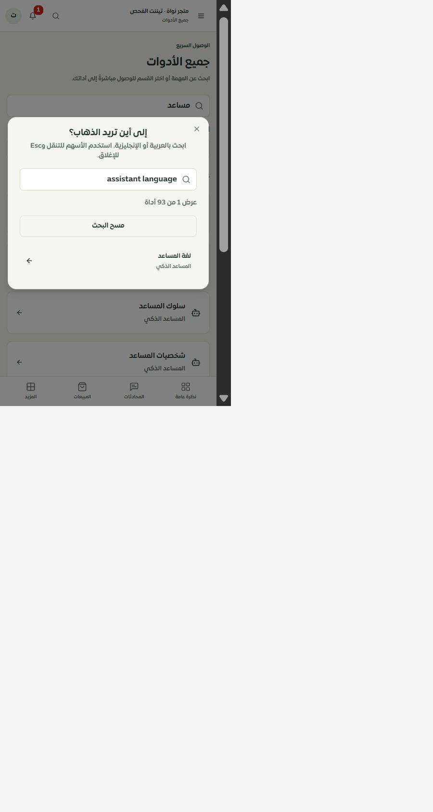
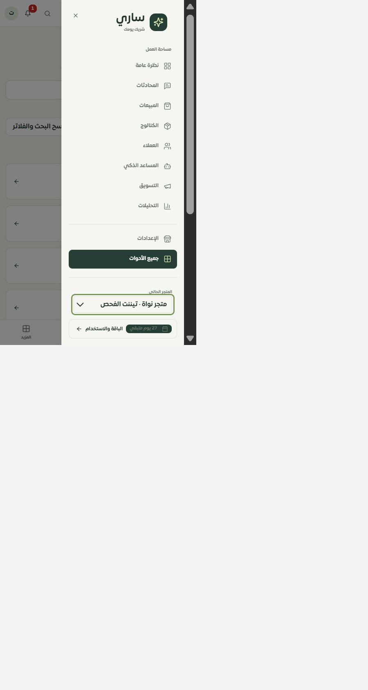

# البحث والتنقل المشترك — المرحلة189 — 1 أكتوبر2026

وُحّد البحث العام مع دليل الأدوات:93وجهة، وكلمات متعددة وأسماء عربية وإنجليزية والتشكيل والروابط السابقة ومصطلحات التكامل الحالي. أضيف عدّ النتائج ومسح البحث والتنقل بالأسهم وHome/End مع المحافظة على تركيب النص وعودة التركيز بعد الإغلاق.

حُولت نصوص الغلاف والقوائم وتأكيد الخروج إلى مفاتيح ترجمة. تتبع القائمة والحوارات اتجاه اللغة، وأصبح زر إغلاق قائمة الهاتف مترجمًا وبمساحة44×44بكسل، وتعود القائمة إلى زر فتحها الفعلي بما فيه «المزيد». صُحح تحديد «جميع الأدوات» كي لا يظهر «الإعدادات» كصفحة نشطة ثانية.

## مشكلة كشفها التطبيق الفعلي

نجحت اختبارات القاموسين أولًا، لكن التطبيق يحمّل العربية وحدها وفق بوابة اللغات المعتمدة. لذلك لم يُظهر بحث `assistant language` نتيجة. نُقلت المفردات الإنجليزية اللازمة للبحث إلى فهرس البحث عبر تصديرJSON محدد، دون إتاحة الإنجليزية كلغة تطبيق. أضيف اختبار بموارد عربية فقط ونجح البحث نفسه حيًا في النافذة وصفحة الأدوات. أُعيد بناء موك أب الأدوات بنفس التصحيح.

## التحقق

- **172 حالة ناجحة**:31للبحث والغلاف والمسارات والموبايل، و141للحصر والمحافظة على الخصائص والسجل وموك أب الأدوات. الاختبار يستخدم مكونات الحوار والقائمة الفعلية مع بدائل للمستخدم وقراءة المتجر، ولا يرسل شيئًا خارجيًا.
- TypeScript للعميل والخادم نجح بعد تصحيح تكرارNodeList ليتوافق مع هدف المشروع. البناء نجح؛ الحزمة الرئيسية422412بايت/126385مضغوطة، دون زيادة في الحزمة الرئيسية. تحذير الحزم الكبيرة المتقدم موجود في البناء.
- الترجمة:11048استدعاء و883مفتاحًا ديناميكيًا مفحوصًا، دون مفاتيح أو معاملات مفقودة. عُدّل المدقق ليفحص مفاتيح الغلاف المحدودة من كتالوج الأدوات، دون استثناءات صامتة.
- المتصفح المحلي بعرض480×844: البحث الإنجليزي أظهر نتيجة واحدة، والسهم السفلي نقل التركيز للرابط. النافذة418×357.5ضمن العرض، والخط16بكسل والسهم دون انعكاس مزدوج. قائمة الهاتف تحدد رابطًا نشطًا واحدًا، وزر إغلاقها44×44؛ عادت إلى زر المزيد بعد انتهاء حركة الإغلاق.
- الحصر الحالي126مسارًا و337ملفًا و2189عنصر تحكم، ولا مسارات محذوفة أو روابط ثابتة غير صالحة. الحصر الساكن لا يثبت تنفيذ كل حالة تشغيل.

## حدود المرحلة

الواجهة الإنجليزية مثبتة باختبارات المكوّن؛ لغة التطبيق الحية ما زالت العربية. لا Safari/iPhone فعلي ولا فحص320/390 في هذه المرحلة. غلاف الموك أب المستقل يحتاج مطابقة البحث والترجمة في المرحلة التالية. لا اتصال بمزود أو نشر.

