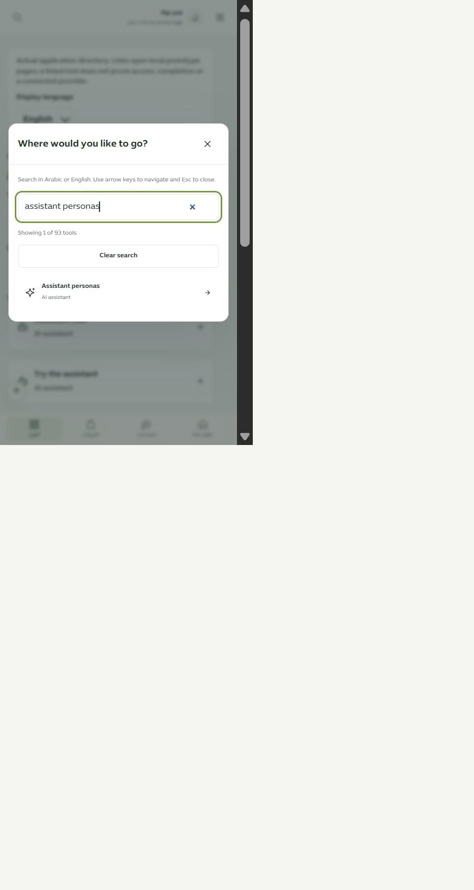

# مطابقة بحث الموك أب وتنقله — المرحلة190

أُزيل بحث15نتيجة الذي كان يعتمد كتالوجًا قديمًا. يستخدم البحث العام الآن محرك التطبيق نفسه وقواميسه وجميع وجهاته الـ93، وتفتح النتائج صفحات الموك أب المحلية مباشرة. يتبع عنوان البحث وتسمياته واتجاهه لغة دليل الأدوات عند فتحه منه، بينما يبقى الغلاف العام عربيًا.

تظهر أعداد النتائج ومسح البحث وحالة الفراغ، مع التنقل بالأسهم وHome/End والرجوع لحقل البحث. لا تُستبدل خانة الإدخال أثناء الكتابة، وتُحترم حالة تركيب النص. Ctrl+K يفتح ويغلق النافذة، وEscape يغلقها ويعيد التركيز. كشف المتصفح أن Escape على `type=search` كان يمسح النص أولًا؛ أضيف إغلاق صريح واختُبر حيًا بعد التصحيح.

حُذف دليل الأدوات القديم غير المطابق. تُحوّل الروابط `#/tools` و`#/tools/ai` إلى الدليل الحالي مع القسم. أُصلح تمييز القائمة في صفحة الأدوات وعودة التركيز إلى زر فتح قائمة الهاتف.

## التحقق

- **24 حالة ناجحة**: تطابق الكتالوج، الاسم الإنجليزي والتشكيل، النص الآمن، جميع النتائج دون قص، التنقل والفلاتر واللغة والرجوع، التركيب والاختصارات، روابط الدليل القديمة، فحص كتالوج126مسارًا و7حالات. فحص الأنواع الخاص بالمعاينة وفحص JavaScript نجحا.
- فحص المتصفح:93رابطًا، ثم نتيجة واحدة لـ`assistant language`؛ فتحها بـEnter نقل إلى إطار خيارات اللغة، والرجوع أعاد القسم السابق. الإنجليزية عرضت `assistant personas` بعنوان واتجاه صحيحين.
- عرض480: المستند450/450، والنافذة418بعرض داخلي416/416 دون تجاوز؛ خط الإدخال16بكسل. اللقطة فُحصت بصريًا. أُثبت إغلاق Escape وعودة التركيز بعد الإصلاح.
- لا تغيير في مصدر بيانات التطبيق أوواجهاته ولا شبكة خارجية. الموك أب يستخدم محرك البحث الحقيقي، لكنه لا يعيد استخدام غلافReact كاملًا؛ لا ادعاء مطابقة كل حالات الغلاف أوالصفحات المقصودة.

لم يُفحصSafari/iPhone الفعلي. لا نشر. التالي مراجعة الصفحة الرئيسية وخصائصها ومصدر أرقامها ضمن سجل الصفحات المتبقية.

