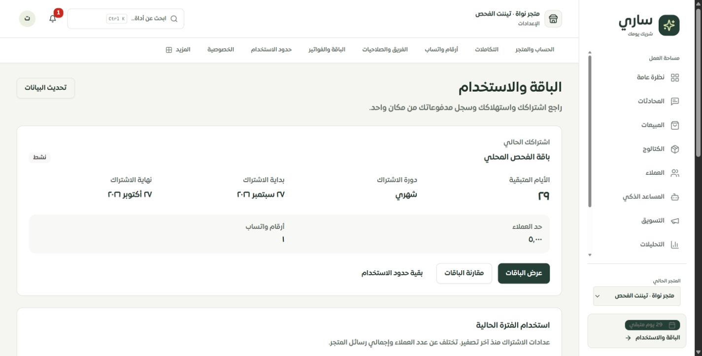
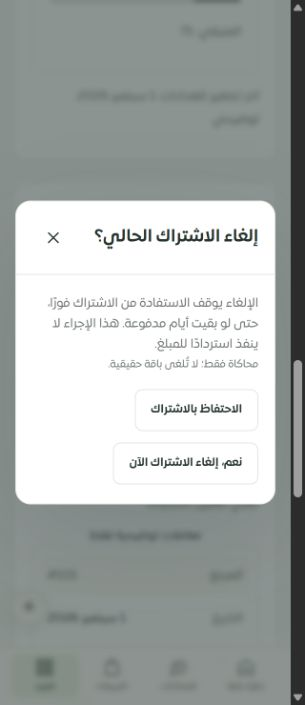

# الباقة والاستخدام — فحص وتحديث 2026-09-28

أعيدت صفحة الاشتراك إلى تصميم لوحة التاجر، مع عدادات الاستخدام الفعلية وسجل مدفوعات مستقل وحماية إلغاء الاشتراك. حُذفت صفحة `Subscriptions.tsx` القديمة بعد مطابقة مصدر بياناتها وبدائل وظائفها. هذه دفعة من الفحص؛ لا تعني اكتمال كل صفحات النظام أو اختباره بنسبة 100%.

## ما تغيّر ولماذا

| المشكلة | الإصلاح والتحقق |
| --- | --- |
| الصفحة القديمة تعرض عدادات غير موجودة في صفحة الاشتراك الحالية | ثبت أن المصدر القديم إسقاط توافق للجداول الحالية. نُقلت المحادثات والرسائل والصوتيات مع حدود الباقة وموعد تصفير العدادات؛ بقيت روابط اختيار الباقة والمقارنة والاستخدام. |
| احتمال إظهار فراغ عند فشل القراءة أو إخفاء المدفوعات بعد انتهاء الاشتراك | فصل حالات التحميل والخطأ والفراغ للمصدرين. سجل المدفوعات يبقى مستقلًا؛ المعلّق لا يعني التفعيل. |
| أرقام غير محدودة أو مفقودة أو حد صفري قد تُفهم خطأ | تمييز غير محدود، غير متاح، غير مشمول، وصل إلى الحد. لا تحويل البيانات المفقودة إلى صفر؛ يبقى الاستهلاك الحقيقي ظاهرًا عند تجاوز الحد. |
| تجربة دون باقة تحتاج حدودًا صحيحة | مشاركة حدود الإنفاذ نفسها: 100 محادثة، رسائل غير محدودة، 20 رسالة صوتية. حساب الأيام وتاريخ النهاية المعروض يستخدمان الموعد الأقرب من نهاية التجربة والاشتراك. |
| نافذة إلغاء قد تعتمد اشتراكًا تغيّر أثناء المراجعة | الواجهة ترسل رقم الاشتراك الذي راجعه التاجر؛ الخادم يقفل صف التاجر ثم الاشتراك ويمنع إلغاء اشتراك أحدث. الفشل يعرض رسالة آمنة دون تفاصيل SQL. |
| احتمال حفظ الإلغاء جزئيًا أو تكراره | تعديل الاشتراك واستحقاق التاجر داخل معاملة واحدة، مع rollback كامل عند الفشل. التكرار المتزامن ينجح مرة واحدة. |
| أثر الإلغاء غير واضح | بيان أنه فوري حتى مع بقاء أيام مدفوعة، وأنه لا ينفذ استردادًا. تأكيد مستقل وتركيز أولي على الاحتفاظ بالاشتراك، وتعطيل التكرار أثناء الطلب. |
| فقد تركيز لوحة المفاتيح عند إغلاق نافذة الإلغاء | أعيد التركيز إلى زر فتح النافذة، وثُبت ذلك باختبار واجهة ومتصفح عند 320 و390 بكسل. |
| تعطل قائمة الباقات مع JSON غير مصفوفة | تحليل المزايا إلى نصوص صالحة فقط؛ منع قرار الدفع عندما تفشل قراءة الباقة أو الاشتراك، وإظهار حالة عدم وجود باقات. |
| صفوف الدفع لا تناسب الهاتف | عرض بطاقات السجلات على الهاتف مع المرجع والتاريخ والنوع والمبلغ والحالة، بما فيها المستردة. |

لم تُنقل مزايا قديمة مبنية على ترتيب الباقة في المصفوفة أو ادعاءات تسويقية ثابتة؛ تعرض واجهة اختيار الباقة مزاياها المسجلة. لم تكن mutation طلب الترقية في الملف المحذوف مرتبطة بزر؛ بقي مسار الاختيار والمقارنة والدفع الحالي. لم تُغيّر بوابة الدفع أو أسعارها أو إجراء الاسترداد.

## الموك أب ونطاق المطابقة

المعاينة: `http://127.0.0.1:4329/#/page/merchant/subscription`، والتطبيق المحلي: `http://127.0.0.1:3018/merchant/subscription`.

تستخدم المسارات `/merchant/subscription` و`/merchant/subscriptions` و`/merchant/my-subscription` الشاشة نفسها. أضيفت لها وحدة تفصيلية مستقلة في الموك أب: نشط، تجربة دون باقة، غير محدود، دون اشتراك، تحميل وخطأ؛ وسجل مدفوعات عادي أو فارغ أو متعطل. يمكن إعادة كل مصدر مستقلًا وتجربة الاحتفاظ أو تأكيد الإلغاء المحلي؛ لا اتصال بدفع أو حساب حقيقي. تاريخ المثال المرجعي 12 سبتمبر 2026، كي تتسق الأيام مع تواريخ المثال.

حالة تغطية هذه المسارات **تفصيلي جزئي**: حالات التعارض والطلب الجاري وفشل الإلغاء موجودة ومختبرة في التطبيق، لكنها ليست سيناريوهات قابلة للاختيار في الموك أب. كذلك حالات الحد المفقود والصفري والمتجاوز مثبتة في اختبارات المنطق وليست خيارات معاينة مستقلة. صفحات اختيار الباقة والمقارنة والدفع ما زالت موك أب عامًا وتحتاج مطابقة منفصلة. لا يدّعي هذا التقرير اختبار شراء أو إلغاء إنتاجي.

## الأدلة

- **54 اختبارًا** في 7 ملفات: 11 للواجهة، 9 لعقد الوصول والمدخلات، 3 للعدادات والمزايا والمدة، 3 للموك أب، 14 لاختبارات حالة الاشتراك الأمنية السابقة، 8 للدفع عبر Tap، و6 لاختبارات MySQL الجديدة.
- اختبارات MySQL على `sari_pages_test` المحلي وبحسابات مؤقتة: فصل تيننتين، رفض رقم اشتراك تيننت آخر، منع إلغاء اشتراك أحدث، رفض المنتهي، تسلسل الإلغاء المتزامن، والتراجع عن التعديلين عند فشل حفظ الاستحقاق. نُظفت حسابات الاختبار.
- اختبارات الوصول تستخدم سياقًا وبدائل للدوال، ولا تُعد بمفردها اختبار تكامل تسجيل دخول. روجعت دالة `getMerchantByUserId`: تحترم التيننت المحدد وسياق الملكية؛ ليست اختيارًا عشوائيًا لأول متجر.
- نجح TypeScript وبناء العميل والخادم وفحص حجم حزمة الدخول. يبقى تحذير Vite المعروف لبعض الحزم الكبيرة؛ لا يُسمى البناء نشرًا.
- فحص الترجمة: 8145 استدعاءً، بينها 348 مفتاحًا ديناميكيًا مفحوصًا، دون مفاتيح مفقودة أو استدعاءات ديناميكية غير محسومة أو اختلاف متغيرات interpolation. أضيفت مفاتيح عربية وإنجليزية بتطابق نوعي. لا إثبات بصري إنجليزي جديد في هذه الدفعة.
- متصفح Chrome: التطبيق والموك أب بعرضي 320 و390 بكسل، حدود نافذة التأكيد، بقاء الأزرار داخل الشاشة، عودة التركيز، وصفوف المدفوعات. لا تجاوز أفقي لعرض الوثيقة في القياسات المسجلة. [القياسات](browser-checks.json).
- أُضيفت أربع معاملات دفع وهمية فقط في قاعدة الفحص المحلية لعرض الحالات، ثم حُذفت بنطاق التاجر وعلامة fixture المحددين؛ ظهر السجل فارغًا وبقي اشتراك الفحص نشطًا. لم يُنفذ تأكيد إلغاء على تيننت المعاينة، ولم تُرسل طلبات لمزود الدفع.

## الحصر وما بقي

[حصر المصدر](source/FEATURE_REGISTER.md): 126 مسارًا، 186 ملف واجهة متصلًا، 1642 عنصر تحكم، 575 تسمية لا يحسمها الفحص الساكن، صفر روابط حرفية غير مطابقة، وملف صفحة قديمة واحد غير مربوط: `WhatsApp.tsx`. العدد ليس نسبة اختبار أو اكتمال تصميم. [السجل العام لكل المسارات](../tenant-testing-workspace-2026-09-28/REMAINING.md).

بعد حذف `Subscriptions.tsx` بقيت واتساب عمدًا لحين حل فروق حقيقية:

1. الطلبات القديمة في `whatsapp_connection_requests` والجديدة في `whatsapp_requests`؛ الحذف الشكلي قد يخفي طلبات معلقة من واجهة المستخدم.
2. `whatsapp.getStatus` القديم قد يحدّث الطلب ثم يبدأ مقابلة إعداد ويرسل رسالة ترحيب. لذلك لا يصلح اعتباره فحصًا بلا أثر على مزود حقيقي.
3. `whatsapp.disconnect` القديم يستمر بعد فشل تسجيل الخروج، ويحذف طلب الربط وجميع instances للتاجر. يجب استبدال هذا التدفق بمعالجة الربط المحدد وتأكيد نتيجة المزود، مع اختبارات عزل وترحيل قبل إزالة البديل القديم.
4. صفحة `WhatsAppInstancesPage` الحديثة تدير روابط محددة، لكن مطابقة الطلبات القديمة والمصالحة واختبار المزود لا تزال مفتوحة. لم تُعدّل شيفرة واتساب في هذه الدفعة.

اختبار Safari/WebKit وآيفون فعلي ما زال مفتوحًا؛ تغيير عرض Chrome لا يغطيهما. يبقى أيضًا اختبار المزود الحقيقي للمدفوعات، والمصالحة وسلوك بقية نماذج النظام، دون ادعاء اكتمال أو خلو مطلق من المشكلات. لا migrations جديدة لهذه الدفعة، ولا دفع Git أو نشر إنتاجي.
