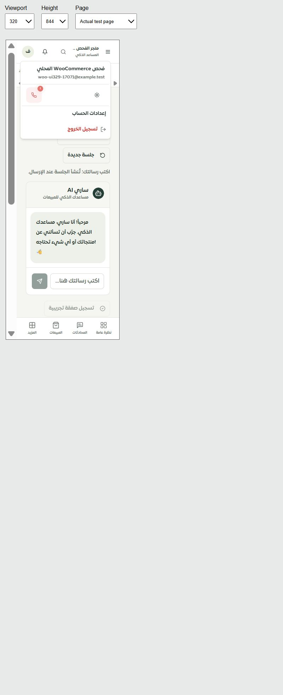

# مرحلة 349 — مطابقة المسودة وفحص الهاتف

وُوئمت مسودة موك أب «جرّب ساري» مع التطبيق: تبقى في ذاكرة الصفحة أثناء التنقل والعودة، ولا تدخل التخزين المحلي. تشمل الحماية قيمة الصفقة غير المحفوظة، وتُزال عند تأكيدها. تُنظف المسودات التاريخية من نسخة المثال المحفوظة؛ إعادة تحميل المثال تستعيد المحفوظ فقط دون المسودة أو إعادة الإرسال.

أظهر الفحص الحي عناصر لمس صغيرة، فأُصلحت حقول صفحة التجربة وأزرارها وعناوين أقسامها القابلة للفتح، وأزرار ترويسة التاجر ومحدد التيننت وقائمة الحساب. أصبحت نوافذ الجلسة والسجل محدودة بارتفاع الشاشة مع تمرير داخلي وبدائل `vh/svh/dvh` وحافة المنطقة الآمنة. أُصلحت المقاسات المقابلة في الموك أب، بما فيها مساحة تسمية مربع التأكيد.

أضاف فحص الوصول أسماء الموظفين إلى أوصاف أزرار التعديل والعرض والتفعيل والإيقاف. كان اختبار الحصر الساكن لا يتعرف على مساعدي الترجمة `text/collection` ويطلب عدد أيقونات قديمًا؛ صُحح التعرف وأضيف اختبار يثبت استمرار رفض الأيقونة غير المسماة. كما صُحح انتظار استعادة التركيز بعد إغلاق نافذة الموظف؛ إعادة التركيز مؤجلة من مكوّن الحوار.

## التحقق

- 72/72 حالة للواجهة والمسودة والموظفين والوصول والتنقل، و139/139 للموك أب والجسر ومعاينة الموظفين، و13/13 لغلاف اللوحة وتبديل التيننت: **224 حالة ناجحة** في المجموعات النهائية.
- TypeScript والترجمة وبناء التطبيق وبناء معاينة الخدمات ناجحة. الترجمة: 12,805 استدعاءات و880 مفتاحًا ديناميكيًا، دون نقص أو أخطاء معاملات. تنبيه أحجام الحزم الكبير المعروف ما زال موجودًا.
- 11 قياس قبول نهائي في [ملف القياسات](responsive.json): التطبيق والموك أب × أربعة عروض 320/390/768/1440، نافذتا سجل ومراجعة عند 320×550، وقائمة الحساب عند 320. لا زيادة أفقية ولا مفاتيح خام ولا عناصر تحكم مقاسة أقل من 44 بكسل؛ يُحسب مربع التأكيد مع مساحة تسميته القابلة للنقر.
- الواجهة الفعلية وموك أبها احتفظا بالنص أثناء الانتقال والعودة، دون إرسال أو توليد. قائمة الحساب فُحصت بصريًا؛ شريط التمرير في الواجهة العربية ظهر على اليسار، فلا يُستنتج القص من مقارنة إحداثي يمين القائمة بعرض `clientWidth` وحده.

[التطبيق 390](actual-390.png) · [مراجعة الموك أب 320](review-320.png).

الأدلة المحلية: `.tmp/tenant-ux/phase349-ui-verified.json` و`phase349-prototype-final.json` و`phase349-shell.json` و`phase349-types-verified.log` و`phase349-translations.log` و`phase349-build-final.log`.

## حدود الإثبات

حُفظت القياسات الأولية وإخفاقات الاختبارات أيضًا؛ تُميز قائمة `accepted` القياسات النهائية عن المشكلات التي صُححت وعن حركة خروج القائمة. يقل عرض المحتوى 30 بكسل عن الإطار في بيئة Windows والتكبير الحالية. استخدم فحص الموك أب نسخة محلية معزولة على 4330 تسمح بإطار من المصدر نفسه، لأن سياسة النسخة الرئيسية تمنع تضمين الصفحة المركزية. لم تُغيّر سياسة 4329؛ أُوقف خادم الفحص وأُخرجت ملفاته المؤقتة من ملفات التطبيق والموقع قبل البناء النهائي.

الفحص بالعربية، وهي لغة التطبيق المفعلة حاليًا؛ لا تبديل مصطنع للغة المعلنة. ليست هذه محاكاة لمحرك Safari أو لوحة مفاتيح iPhone الفعلية. ما زالت استعادة عمليات التوليد الدائمة ومطابقة كل أخطاء حفظ الرسائل ومصدر الحارس في موك أب التجربة مفتوحة. لا مزود أو رسائل خارجية أو نشر.
