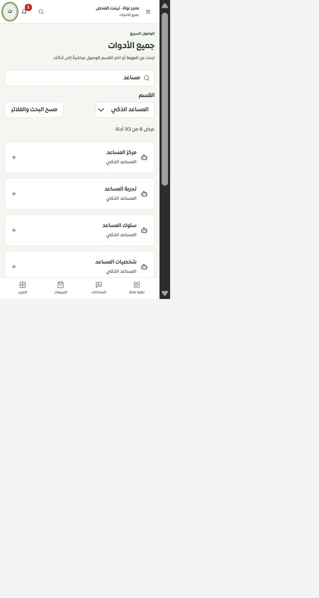

# جميع الأدوات — شاشة التطبيق — 1 أكتوبر 2026

أُعيد تنظيم صفحة `/merchant/tools` بمكوّن قابل للاستخدام في الموك أب. بقيت **93 وجهة قابلة للتنقل** دون إسقاط مساراتها، مع ترجمة أسماء أدوات الكتالوج الـ102 والأقسام التسعة بالعربية والإنجليزية. لا تُعرض مسارات التفاصيل التي تتطلب معرّفًا أو نتائج الدفع كتطبيقات مستقلة، كما في الكتالوج السابق.

البحث يقبل اللغتين والمسار والأسماء السابقة والأقسام، ويتجاهل التشكيل والتطويل واختلافات الألف. يبحث بكل الكلمات المدخلة، ويحفظ البحث والقسم في الرابط. القسم غير المعروف يعرض جميع الأقسام مع شرح، والنتائج الفارغة لها إجراء لمسح الفلاتر. أسماء الحقول والنتائج معلنة لقارئ الشاشة، وعناصر اللمس44 بكسل والنص داخل المدخلات16 بكسل. أُصلح انعكاس السهم مرتين عند RTL بعد كشفه بصريًا.

## التحقق

- **156 حالة ناجحة**: البحث واللغتان والتنقل وحفظ الفلاتر ومسارات الكتالوج، مع136 حالة للحصر وحفظ الخصائص والسجل. أحد توقعات الاختبار الأولى كان ضيقًا أكثر من سلوك البحث الجزئي، وصُحح ليستخدم المسار الكامل عند التحقق من بديل محدد.
- TypeScript وبناء العميل والخادم نجحا؛ فحص الترجمة:11003 استدعاءات و772 مفتاحًا ديناميكيًا مفحوصًا، دون مفاتيح أو معاملات مفقودة. أضيف حل مفاتيح الكتالوج إلى المدقق دون إعفاء الاستدعاءات الديناميكية.
- فحص محلي فعلي على عرض480: المستند450/450 دون تجاوز، المدخل والاختيار والزر44بكسل، واستعادة البحث «مساعد» والقسم بعد فتح «لغة المساعد» ثم الرجوع وإعادة التحميل. العربية حية؛ الإنجليزية مثبتة باختبار المكوّن هنا، لأن بوابة لغات التطبيق ما زالت تعرض العربية فقط.
- حصر المصدر:126 مسارًا،337 ملفًا،2188 عنصر تحكم. لا مسارات محذوفة ولا روابط ثابتة غير صالحة. أعداد العناصر إشارات حصر وليست شهادة تغطية تشغيل.

اللقطة توثق مساحة المستند داخل لوحة المتصفح؛ الفراغ المحيط تابع لمساحة الالتقاط. لا Safari/iPhone فعلي ولا نشر. الموك أب ما زال في هذه المرحلة يستخدم الدليل القديم؛ المرحلة التالية استبداله بالمكوّن نفسه واختبار البحث والتنقل واللغة فيه. لذلك لم تُرفع حالة المسار إلى تصميم مطابق بعد.
