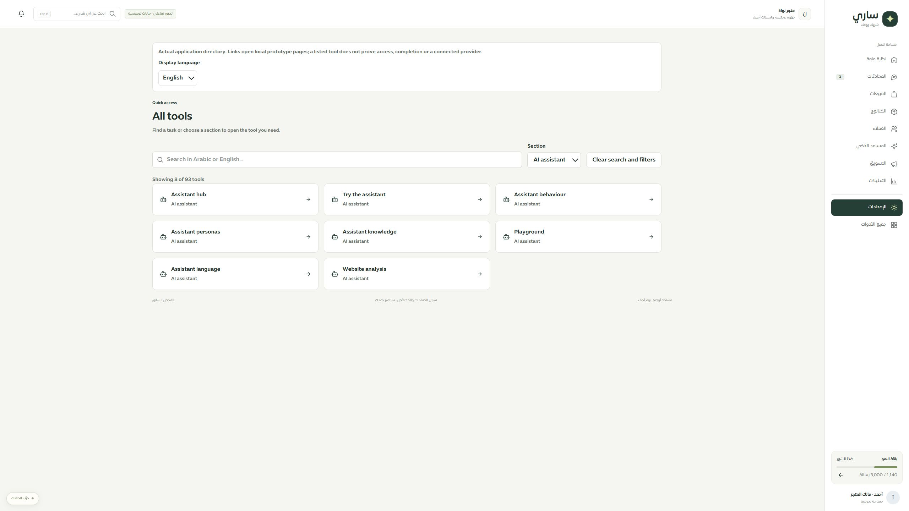
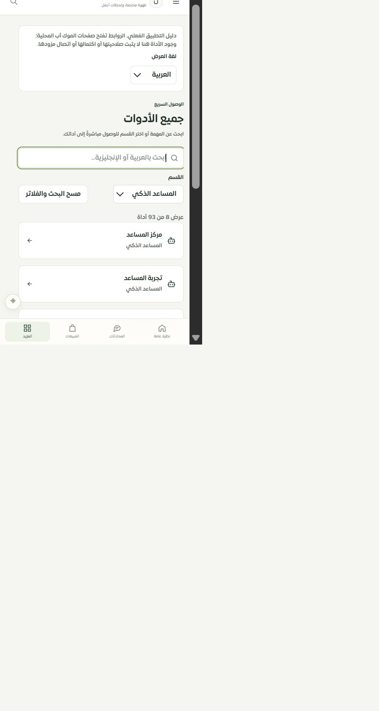

# مطابقة موك أب جميع الأدوات — المرحلة188

استُبدل الدليل العام بمكوّن `MerchantToolsDirectory` الفعلي وقواميسه وأنماطه. يعرض93وجهة كما في التطبيق مع بحث عربي/إنجليزي وتصفية بالقسم وحالة نتائج فارغة ومسح الفلاتر. لا يرسل الموك أب بيانات إلى خادم أو مزود.

حُفظ البحث والقسم واللغة في الرابط. يدعم الإدخال المركب دون هدم الحقل أثناء الكتابة، ويُعيد التركيز والمؤشر بعد العرض. أزيل العرض العام المكرر لهذا المسار، وبقي عنوان واحد.

أظهر الفحص المرئي تداخل ألوان الفقرات وظل جسم التطبيق مع غلاف الموك أب؛ عُزلت هذه الأنماط وصُحح التباين. اللون المقاس للنص الثانوي بعد الإصلاح `rgb(102,115,106)`، وظل الحاوية `none`.

## التحقق

- نجحت22حالة في `tools-prototype` و`merchant-page-prototype` و`merchant-tools`، مع فحص الأنواع الخاص بالمعاينة. تغطي مطابقة الروابط، البحث والفلاتر، الترجمات، التركيز، تركيب النص، النص الآمن، وعدم استدعاء الشبكة.
- بوابة كتالوج الموك أب تمر على126مسارًا و7حالات؛ تحققت الصفحات المضمنة من الوجهة والعنوان ووجود ملف المكوّن، لأن JSDOM لا يعرض محتوى iframe. هذا ليس فحصًا بصريًا لكل الصفحات الداخلية.
- في المتصفح: البحث `language` أظهر نتيجة واحدة، ثم فتح لغة المساعد والرجوع وإعادة التحميل احتفظ بالبحث والقسم والإنجليزية. تغيير لغة الدليل للعربية أبقى البحث. حالة عدم النتائج ثم المسح أعادت الأدوات.
- سطح المكتب2560: عرض المحتوى والتمرير2560 دون تجاوز أفقي. العرض الضيق480: عرض المحتوى والتمرير450، والحقول والأزرار44بكسل والخط16بكسل. اللقطتان المرفقتان فُحصتا بصريًا.
- نجحت136حالة للحصر والمحافظة على خصائص المسارات ومطابقة سجل الاستكمال. مجموع الحالات المميزة لهذه المرحلة158. صارت حالة الدليل تفصيلية، والتغطية الحالية126مسارًا:72عامًا و36جزئيًا و10تفصيلية و8تحويلات. لا تعديل لخط أساس28سبتمبر.

## الحدود

الإنجليزية تخص الدليل؛ غلاف الموك أب ما زال عربيًا. وجود رابط لا يثبت صلاحية التيننت أو اكتمال الصفحة المقصودة أو مزودها. لا اختبار Safari/iPhone فعلي أو320/390 في هذه المرحلة، ولا نشر. المرحلة التالية البحث والتنقل المشترك في التطبيق ثم بقية سجل الصفحات.

