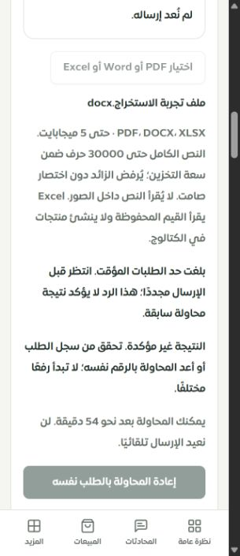
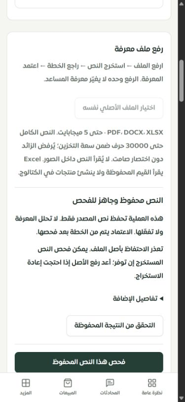
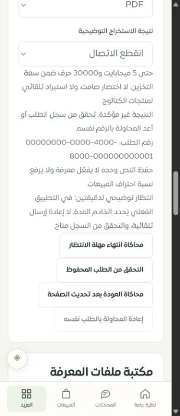

# استعادة رفع المعرفة ورسائل الرفض — 29 سبتمبر 2026

أُغلق بند التحقق الحي من إعادة اختيار أصل الملف بعد تحديث الصفحة، وأصبحت رسائل رفض الرفع تبيّن السبب والخطوة التالية. هذه جولة محددة في ملفات معرفة عقل ساري، وليست إعلانًا باكتمال فحص كل صفحات التيننت أو Safari.

## ما تغيّر

- تمييز انتهاء الجلسة، غياب صلاحية إدارة المعرفة، تعارض الطلب، رفض صيغة/حجم الملف، وحد الطلبات المؤقت. لا تعرض الواجهة نصوص أخطاء الخادم الخام.
- احترام `Retry-After` الصحيح بالثواني أو التاريخ، وتعطيل الإرسال خلاله دون إعادة إرسال آلية. لا تُختلق مدة انتظار إن لم يرسل الخادم مدة موثوقة.
- الاحتفاظ برقم الطلب السابق عند رفض إعادة المحاولة؛ الرفض الحالي لا يحسم نتيجة المحاولة السابقة. قراءة السجل تبقى متاحة أثناء الانتظار.
- تختفي رسالة الانتظار بعد قراءة نتيجة مؤكدة، لكن يبقى حد الإرسال فعالًا إذا اختار التاجر بدء استخراج آخر داخل النموذج المفتوح.
- أضيفت الحالات نفسها إلى الموك أب، مع توضيح أن انتهاء الانتظار فيه محاكاة يدوية. لا يرفع الموك أب ملفات ولا يتصل بمزوّد.

لم تتغير حصص الخادم أو ضوابط الصلاحيات والتيننت. حد الانتظار في الواجهة ليس بديلًا عن حد الخادم، ويعاد طلب حالته بعد إعادة فتح النموذج. استعادة النص بعد إغلاق/تحديث الصفحة ليست ضمن هذه الجولة.

## التحقق الحي

التطبيق المحلي `127.0.0.1:3018`، قاعدة `sari_pages_test`، متجر «متجر نواة · تيننت الفحص». استُخدم ملف Word اصطناعي فقط، مع استمرار حظر الاتصالات الخارجية. لم نعدّل أو نمسح حصص الرفع.

1. قراءة قاعدة البيانات قبل الفحص أظهرت استهلاك 5 طلبات في النافذة السابقة و26 ملفًا. انتهت النافذة طبيعيًا قبل إرسال الملف الجديد.
2. حُفظ النص المستخرج من `ملف تجربة الاستخراج.docx` في السجل 957، بالطلب `8404058f-7987-4efd-9998-70570df7a18a`. أصبح العدد 27 ملفًا.
3. بعد تحديث الصفحة استُعيد الرقم دون الملف أو إرسال تلقائي. رُفض اختيار PDF مختلف. اختيار Word الأصلي أتاح إعادة المحاولة الصريحة فقط.
4. أعادت المحاولة النتيجة نفسها. أُعيد الطلب المطابق أربع مرات إجمالًا بعد الرفع الأول للتحقق من منع التكرار والوصول إلى حد الخادم الطبيعي؛ بقي العدد 27، والسجل نفسه 957.
5. رفض الخادم المحاولة التالية بسبب حد الرفع. ظهرت مدة الانتظار، وكان زر إعادة الإرسال معطلًا وزر قراءة النتيجة متاحًا. نجحت القراءة أثناء الانتظار وأظهرت النص المحفوظ. تفاصيل السيناريو في [دليل المتصفح](browser-checks.json) و[قراءة قاعدة البيانات النهائية](database-check.json).

تعذر حفظ أصل الملف في التخزين الخارجي بسبب عزل البيئة المحلية؛ أوضحت الواجهة ذلك، وبقي النص المستخرج قابلًا للفحص. لم تُنفّذ مكالمة نموذج ذكاء اصطناعي، ولم تُفعّل معرفة أو تتغير نسبة احتراف المبيعات.

## التحقق الآلي والمرئي

| الفحص | النتيجة |
|---|---|
| اختبارات الواجهة والمخزن والعزل والصلاحيات وحدود الرفع والموك أب | 242 حالة في 14 ملفًا؛ نجحت |
| اختبارات MySQL للاستخراج والإعادة وحدود الملفات | 21 حالة؛ نجحت |
| إجمالي الحالات المختلفة | **263 حالة في 15 ملفًا** |
| اختبار الرفع بعد آخر تعديل للانتظار | 17 حالة؛ نجحت، محسوبة ضمن الإجمالي أعلاه |
| مفاتيح الترجمة | 8373 استدعاء، 346 مفتاحًا ديناميكيًا؛ صفر مفقود وصفر أخطاء متغيرات |
| بناء الواجهة والخادم والعامل والموك أب | نجح؛ فحص ميزانية الحزمة نجح، وتحذير Vite المعروف لحزمة تتجاوز 600 كيلوبايت باقٍ |
| TypeScript العام | نجح في الفحص النهائي؛ ظهر أولًا TS2352 في ملف العمل المتزامن `merchant-directive-store.ts` ثم زال بعد تحديث ذلك العمل، وأُعيد الفحص بنجاح دون تعديل الملف أو ضمه لهذه الجولة |
| Chrome، التطبيق 320 و390 بكسل | عرض المستند 305 و375؛ لا تجاوز عرض في الحالات المختبرة |
| Chrome، الموك أب 320 بكسل | عرض المستند 305؛ لا تجاوز عرض في حالة الانتظار والاستعادة |
| Safari وiPhone فعلي | لم يُختبرا |

حُفظت نتائج التحقق في [validation.json](validation.json). اختبارات الأمن هنا محددة للصلاحيات وعزل المعرفة وحدود الرفع وعدم إظهار تفاصيل الخادم؛ ليست اختبار اختراق شاملًا أو ضمانًا بعدم وجود ثغرات في بقية النظام.

## المتبقي

اختبار Safari/iPhone الفعلي والتخزين الخارجي والمزوّد، ثم بقية البنود في [سجل الاستكمال](../tenant-testing-workspace-2026-09-28/REMAINING.md). أرقام تغطية الصفحات لم تتغير. هذه التغييرات محلية؛ لم تُدفع ولم تُنشر على الإنتاج في هذه الجولة.
