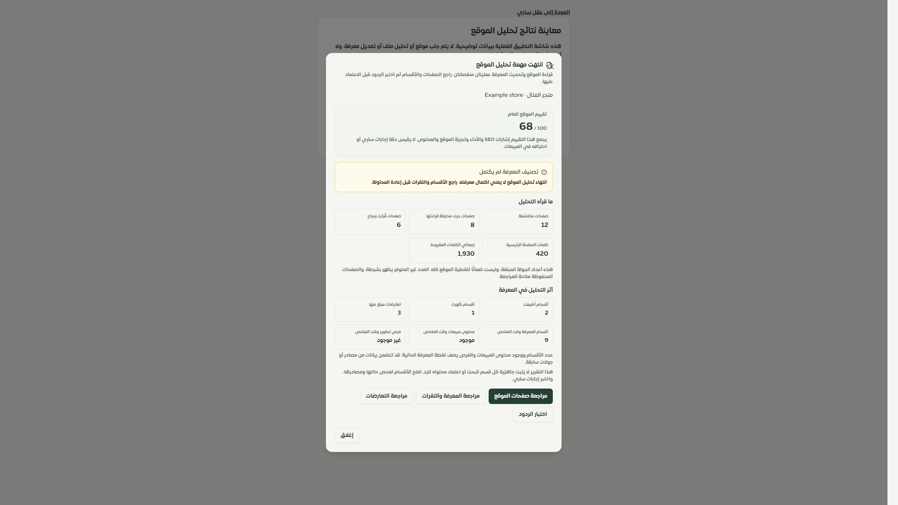
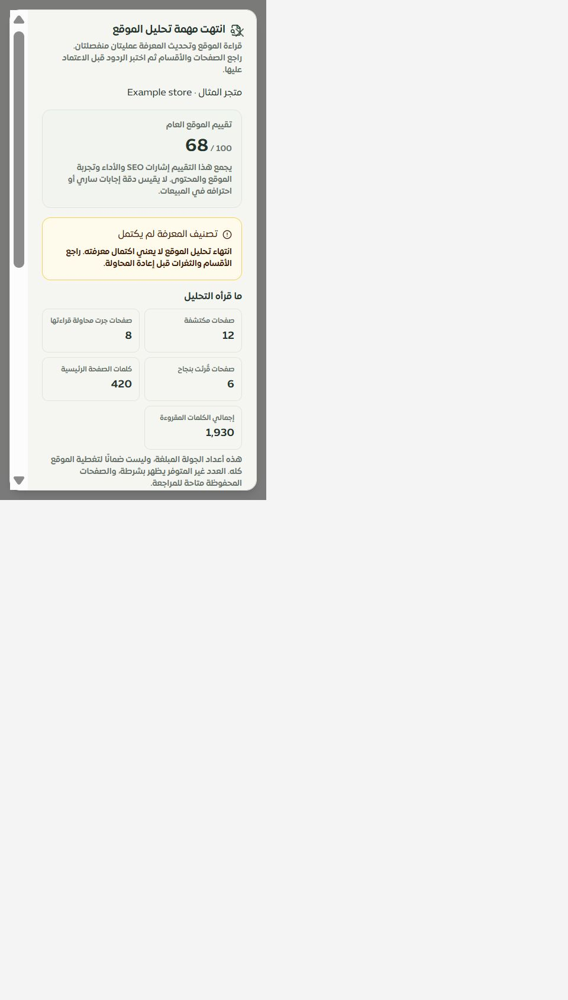
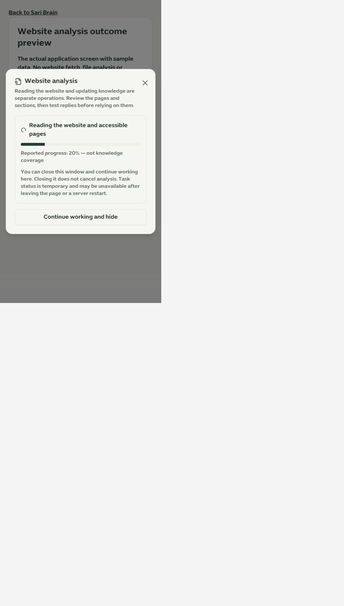

# نتائج تحليل الموقع في عقل ساري

1 أكتوبر 2026 · المرحلة151 · التطبيق المحلي والموك أب · main

استُبدلت نافذة التحليل القديمة بمكوّن موحد يستخدم تصميم التاجر وترجمته. لم تعد نهاية المهمة تعني أن ساري جاهز لخدمة العملاء، ولا يتحول غياب أعداد الأقسام أو الصفحات إلى صفر. زر رفع المعرفة يفتح مساحة الملفات ويضع التركيز على اختيار الملف.

## الإصلاح المثبت

- التقييم المرسل هو `overallScore` (SEO30%، الأداء25%، تجربة الموقع25%، المحتوى20%)؛ عُرض باسم تقييم الموقع العام، مع فصل صريح عن دقة الرد واحتراف المبيعات.
- عرض الصفحات المكتشفة ومحاولات القراءة والقراءات الناجحة والكلمات بأسمائها. لا وعد بقراءة جميع صفحات الموقع أو بانتهاء المهمة خلال دقيقة.
- نتائج إضافة الأقسام وتطويرها وتعارضاتها منفصلة عن لقطة عدد الأقسام ووجود محتوى المبيعات والفرص، التي قد تشمل معرفة سابقة. عدم توفر المقاييس يظهر بشرطة. لا يُدّعى نجاح فهرسة كل الأقسام.
- فشل تصنيف المعرفة ظاهر كنتيجة جزئية دون عرض رسالة المزود الخام. فشل طلب البدء موصوف كطلب غير مؤكد، وفشل قراءة الحالة لا يعرض التقدم القديم على أنه حالي؛ إعادة القراءة لا تنشئ طلب تحليل آخر.
- احتُفظ بنتيجة النافذة عند إغلاقها ويمكن إعادة فتحها داخل الصفحة. الإغلاق متاح أثناء انتظار الطلب أو تشغيله، وروابط مراجعة الصفحات والأقسام والتعارضات وتجربة الردود تصل إلى التبويب الصحيح.
- صُحح تحذير إعادة التحليل: `persistCrawledKnowledge` يستخدم دمج الصفحات والأسئلة، وليس حذفها بالكامل. تغيّر أقسام المعرفة وتعارضاتها يبقى محتملًا ويُشرح قبل التنفيذ.
- الموك أب المرتبط من عقل ساري يستخدم **مكوّن التطبيق نفسه** مع11 حالة وعربية/إنجليزية. لا مزود، ولا تعديل معرفة، ولا نسبة مبيعات مقاسة. إجراء الوجهة يسجل الاختيار في المثال، ولا يعدل بيانات صفحات الموك أب الأخرى.

## التحقق

- نجحت188 حالة: نتائج النافذة14، حالة المهمة4، صفحات/مصادر المعرفة23، حصر وحفظ الخصائص132، موك أب عقل ساري15. احتاج مشغل اختبار الموك أب القديم إلى توفير `MessageChannel` و`TextDecoder` اللذين تستخدمهما حزم React؛ نجحت حالاته15 بعد إصلاح بيئة الاختبار دون إسقاط أي تأكيد.
- فحص أنواع التطبيق وفحص أنواع معاينة النتائج، وبناء التطبيق وبناء الموك أب نجحت. تحذير حجم ExcelJS السابق بقي كما هو؛ ميزانية الحزمة الأساسية نجحت.
- الترجمة:10603 استدعاءات و499 مفتاحًا ديناميكيًا، بلا مفاتيح مفقودة أو معاملات غير مطابقة.
- المتصفح: زر رفع المعرفة انتقل في التطبيق الفعلي إلى `?view=sources`. جُربت النتيجة الجزئية، اختيار مراجعة التعارضات، وخطأ قراءة الحالة ثم التعافي إلى تقدم20% في المثال الإنجليزي.
- العرض الضيق الفعلي480×844، عرض النافذة418 وارتفاعها812 وأعلاها16؛ عرض المحتوى الداخلي386 يساوي عرض تمريره386. استُخدم قياس مساحة العرض ومحددات الموبايل نفسهما من التطبيق. نافذة التمرير الداخلية تحافظ على الوصول للإجراءات. أعيد قياس المتصفح الافتراضي بعد الفحص.
- الحصر:126 مسارًا،320 ملفًا متصلًا،2156 موضع تحكم؛ بلا مسار محذوف أو روابط غير صالحة. نقص عداد الاختيارات الثابتة ناتج عن إزالة المراحل التخيلية القديمة، وليس إزالة خيارات تاجر.

## حدود لم تُغلق

حالة التحليل الفعلية ما زالت مؤقتة داخل عملية الخادم، بلا معرّف مهمة دائم. لم يُنفذ تحليل خارجي في هذه الجولة ولا إعادة ضبط أو حذف مصادر. فحص CSS وعرض ضيق على Chromium لا يثبت Safari أو iPhone فعليين. لا نشر أو دفع. التالي مقاييس جودة الردود وحالات قراءتها، ثم متابعة سجل الصفحات والخصائص.

[المعاينة المحلية](http://127.0.0.1:4329/website-analysis.html)

