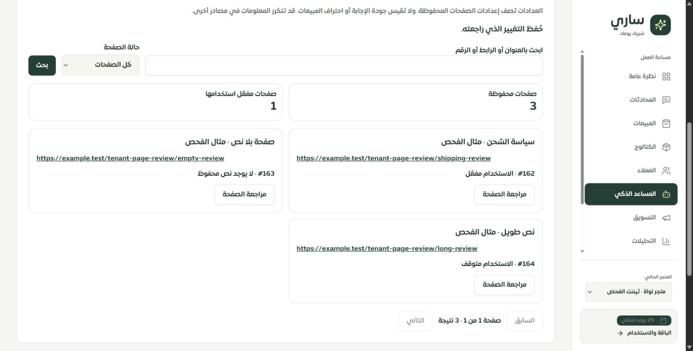
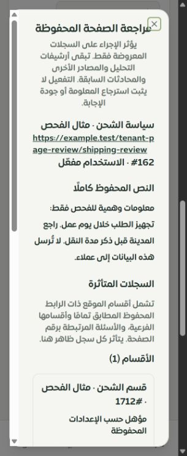

# مراجعة صفحات معرفة الموقع — 29 سبتمبر 2026

استُبدلت شاشة صفحات الموقع القديمة داخل عقل ساري بمساحة مراجعة في التطبيق المحلي والموك أب. هذه دفعة ضمن الفحص المتواصل؛ لا تُغلق فحص جميع صفحات النظام. العمل على `main`، دون دفع أو نشر للإنتاج.

## ما تغير

- تبويب «صفحات الموقع» داخل «المعرفة والفجوات»، مع وصول مباشر من بطاقة مصادر الموقع في الملخص. أضيف البحث بالعنوان والرابط والرقم، والتصفية بالحالة، وعرض ثماني صفحات محفوظة في كل دفعة.
- الصفحات المحفوظة تظهر حتى إن لم يوجد سجل `website_analyses`. فشل القراءة يظهر كخطأ قابل لإعادة المحاولة، ويختلف عن القائمة الفارغة. أُصلح أيضًا سلوك زر تحليل الموقع في الملخص أثناء القراءة وفشلها.
- أُزيلت درجة التغطية القديمة التي جمعت حجم النص وعدد السجلات، وقائمة الادعاءات بأن ساري يستطيع الإجابة، والتقييم التقني المسمى SEO داخل هذه البطاقة. البديل أعداد سجلات وإعدادات محددة، مع بيان أنها لا تثبت جودة الرد أو احتراف المبيعات.
- تعرض المراجعة النص المحفوظ كاملًا دون حد 8000 حرف، مع الأقسام والأسئلة التي سيتأثر استخدامها. النص يعرض كنص ولا ينفذ HTML، والروابط القابلة للنقر تقبل HTTP/HTTPS دون بيانات اعتماد فقط.
- يختار التاجر التفعيل أو الإيقاف أو الحذف صراحة، ثم يوافق على النص والأثر. تغيير الإجراء أو تحديث المراجعة يلغي الموافقة. فشل الحفظ أو تعارض النسخة يوقف إعادة التنفيذ حتى قراءة المراجعة الحالية. صلاحية القراءة لا تعرض أدوات التعديل.
- الموك أب يعرض الرحلة نفسها مع بيانات محلية وحالات قراءة فارغة وفاشلة، وصلاحية القراءة ومحاكاة فشل الحفظ. أُزيلت معالجات العرض والتبديل الفوري القديمة من شاشة صفحاته. عُدل ترتيب أزرار المراجعة على الهاتف.

## نطاق الإجراء وضمانه

تعتمد الروابط على أقسام `source=website` ذات **الرابط المحفوظ المطابق تمامًا**، وكل الأقسام المتفرعة منها، والأسئلة المرتبطة بمعرّف الصفحة. تعرض المراجعة نصوص هذه السجلات، بما فيها أي قسم فرعي من مصدر آخر. لا يطابق النظام روابط مختلفة استنتاجيًا. وجود أكثر من صفحة للرابط نفسه يوقف الإجراء بسبب الالتباس.

يقفل الخادم التيننت ويقرأ الحالة المرتبطة داخل معاملة. تُقارن بصمة الصفحة ومجموعة الأقسام والأسئلة وحالاتها بالنسخة التي راجعها التاجر. أي اختلاف أو إضافة معرفة قيد المعالجة يرفض الإجراء. لا يسمح التفعيل بتجاوز المراجعة أو الصلاحية أو إتاحة الاستخدام للأقسام والأسئلة. يشترط نصًا غير فارغ للصفحة وسجلاتها المرتبطة، ويحفظ حالات الاعتماد والمصدر كما هي.

تغيير الصفحة وأقسامها وأسئلتها والتدقيق وإبطال ذاكرة الردود والسياق ضمن المعاملة نفسها. فشل آخر كتابة تدقيق يعيد كل الحذف السابق. يبقى إيصال إنشاء القسم بعد حذفه. لا تؤثر الاستعلامات أو التعديلات في تيننت آخر. أُوقفت نقطتا `togglePageInBot` و`deleteDiscoveredPage` القديمتان برسالة تتطلب مساحة المراجعة؛ حلّت `changeWorkspacePage` مكانهما في الواجهة. لا توجد migration جديدة لهذه الدفعة.

القائمة تجلب بيانات وصفية وعلامة وجود النص بدل تحميل جميع نصوص الصفحات. المراجعة تجلب نص الصفحة المطلوبة والأقسام والأسئلة المتأثرة فقط؛ وتستخدم بيانات شجرة الأقسام لتحديد الأبناء. التصفية والتقسيم الحاليان يعملان على البيانات الوصفية في ذاكرة الخادم، ولم يُنفذ قياس حمل لتيننت كبير.

**هذا ليس حذفًا شاملًا لكل نسخة من المعلومة:** أرشيفات التحليل والمصادر الأخرى والمحادثات السابقة تبقى. التفعيل لا يثبت نجاح الفهرسة أو الاسترجاع أو استخدام المعلومة في رد. لا تعرض الشاشة نسبة احتراف مبيعات مستنتجة من عدد الصفحات.

## التحقق

- **247 اختبارًا ناجحًا في 7 ملفات**: 25 على MySQL لمساحة الصفحات، 9 للصلاحيات والعزل والأخطاء، 14 لواجهة الصفحات، 38 للموك أب، و161 لاختبارات تراجع صلاحيات المعرفة والأقسام وواجهتها.
- تشمل الحالات: صفحة دون تحليل، النص الطويل، النص الأبيض فقط، البحث والتقسيم، أهلية التفعيل، انتهاء الصلاحية، تكرار الرابط، تغيّر النص أو إضافة ابن بعد المراجعة، قراران متزامنان، تيننت آخر، بقاء إيصال الإنشاء، وإجبار فشل التدقيق بعد الحذف لإثبات التراجع الكامل. يعمل الاختبار على قاعدة `sari_pages_test` المحلية مع حظر الشبكة الخارجية.
- نجح فحص TypeScript والترجمة والبناء وميزانية الحزمة. التفاصيل القابلة للقراءة آليًا في [validation.json](validation.json).
- مجموعة الأمان القديمة: **176 ناجحًا و8 إخفاقات**، مطابقة بأسمائها لخط الأساس المسجل قبل تعديل هذه الدفعة. حُدثت سبعة فحوص نصية كانت تشترط تنفيذ نقاط الصفحات المتقاعدة لتفحص المسار الجديد، وأضيفت اختبارات سلوكية وقاعدة بيانات. لم تُخفَ الإخفاقات الثمانية ولم تُعتبر ناجحة. [المقارنة](security-baseline-comparison.json).

## الفحص الحي

داخل «متجر نواة · تيننت الفحص» أضيفت الصفحات الوهمية #162–164 وقسم #1712 وسؤال #369. جُرّب تفعيل صفحة الشحن ومراجعة حالتها المحدثة ثم إيقافها مجددًا. جميع الصفحات الوهمية متوقفة الاستخدام في نهاية التجربة، والرد التلقائي للتيننت معطل. لم تُطلب الروابط الوهمية ولم يُستدع مزود ذكاء اصطناعي ولم تُرسل رسائل.

| المشهد | العرض المقاس | النتيجة |
|---|---:|---|
| قائمة التطبيق | 1440 | حفظ مؤكد وعداد محدث، بلا تمدد أفقي |
| مراجعة التطبيق | 320 | عرض النافذة ضمن الشاشة، عرض المحتوى الداخلي يساوي عرض التمرير |
| نص طويل في التطبيق | 390 | ظهرت نهاية النص بعد أكثر من 8000 حرف؛ لا عناصر HTML محقونة ولا تمدد أفقي |
| صفحة فارغة | هاتف | خيار التفعيل معطل ورسالة سبب المنع ظاهرة |
| مراجعة الموك أب | 320 | نافذة بعرض داخلي 271 بكسل دون تمدد؛ الأزرار مرتبة للهاتف |

هذه قياسات **Chrome على Windows**، وليست اختبار Safari أو جهاز iPhone فعلي. صور الفحص في هذا المجلد، والقياسات في [browser-checks.json](browser-checks.json).

## ما بقي مفتوحًا

1. **إضافة رابط مخصص** ما زالت تعيد سحب الصفحة عند الحفظ؛ المعاينة غير مثبتة بنفس آلية تقرير إدخال المعرفة الجديد. بقيت الوظيفة متاحة ولم يُدّع إصلاحها في هذه الدفعة.
2. مراجعة رحلة `/merchant/smart-analysis` كاملة، والتداخل بين محركي التحليل وخيارات الاستبدال والتطبيق، وبقية كتّاب صفحات الموقع القديمة مثل `analysis.updatePage/deletePage`.
3. واجهة حسم الروابط المكررة، وربط المصادر القديمة والروابط المتكافئة بأدلة صريحة، وتحديد جميع النسخ في أرشيفات التحليل. المنع الحالي للتكرار مقصود لكنه يحتاج رحلة معالجة مستقلة.
4. لا يوجد إيصال دائم مستقل لأوامر هذه الصفحات. عند انقطاع الاستجابة يُطلب فحص الحالة الحالية؛ إعادة أمر قديم لا تعيد إنشاء صفحة محذوفة، ولا تُعرض نتيجة غير مؤكدة كنجاح.
5. قياس جودة الردود واحتراف المبيعات بأدلة فعلية، وفحص Safari/iPhone الفعلي، وبقية الصفحات في [السجل المركزي](../tenant-testing-workspace-2026-09-28/REMAINING.md).

تظل التغطية الكلية: **126 مسارًا = 101 موك أب عام + 8 تحويلات + 10 تفصيلية + 7 تفصيلية جزئيًا**. عقل ساري ما زال تفصيليًا جزئيًا؛ لا تعني هذه الدفعة اكتمال النظام بنسبة 100%.
