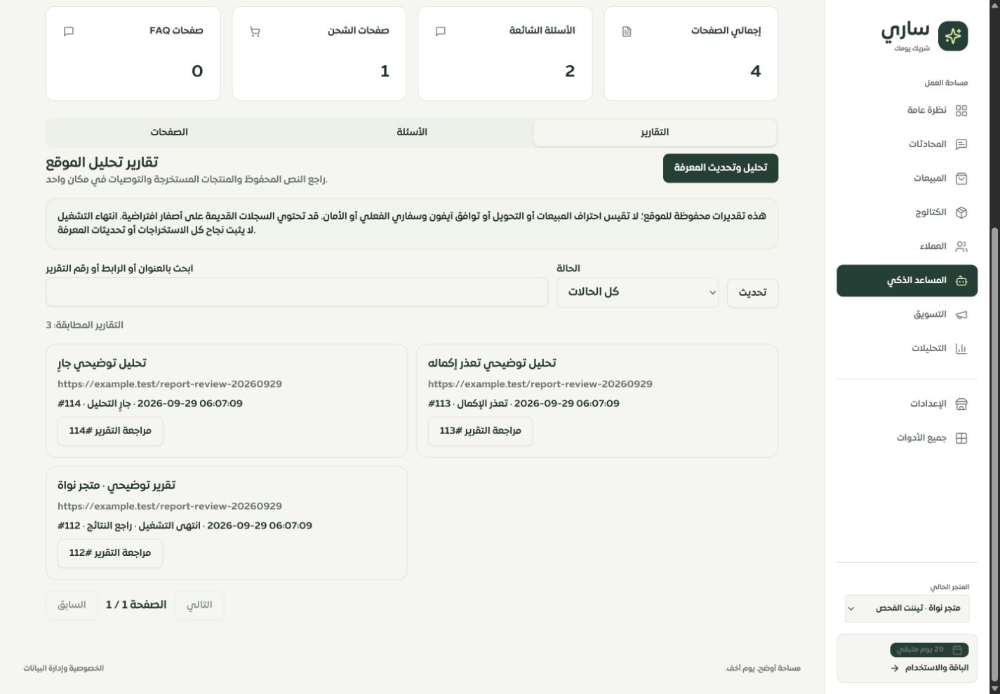
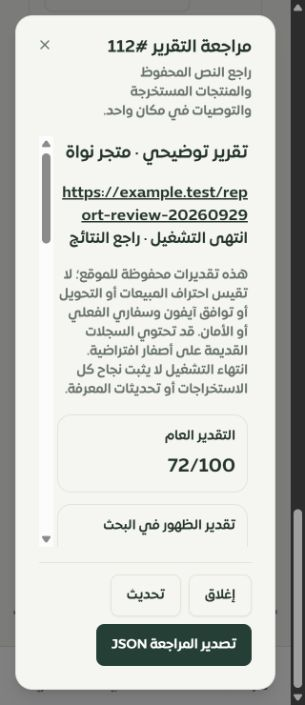
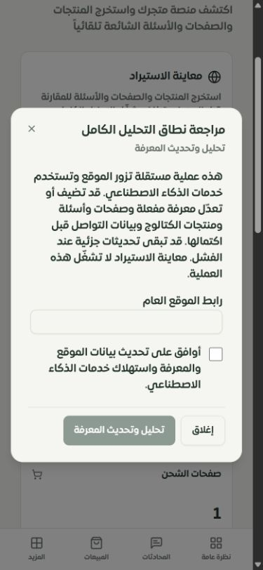
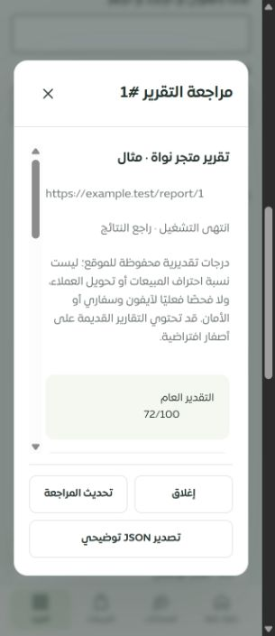

# مراجعة تقارير الموقع في لوحة التيننت

29 سبتمبر 2026 — تغييرات فوق `b4d2fed1` على `main`، محليًا دون دفع أو نشر.

أُعيد تصميم سجل تقارير الموقع ومراجعتها ضمن `/merchant/smart-analysis` في التطبيق والموك أب. هذه دفعة محددة من الحصر؛ لا تعني اكتمال تصميم وفحص كل الصفحات الـ126.

## ما أُصلح

- قائمة من الخادم ببحث حرفي وحالة وتقسيم إلى ثمانية تقارير، مع فصل التحميل وفشل القراءة والفراغ والصلاحية للقراءة فقط.
- مراجعة النص المحفوظ كاملًا، درجاته التقديرية، معلومات SEO، كل سجلات المنتجات المستخرجة والاقتراحات وتفاصيلها. يحافظ العرض على السعر صفرًا ويعرض الروابط غير الآمنة كنص؛ النص المستورد لا يُفسر بوصفه HTML.
- إخفاء الدرجات عند عدم اكتمال التحليل، وتعريفها كتقديرات للموقع. ليست قياسًا لاحتراف المبيعات أو التحويل أو توافق Safari/iPhone أو نتيجة اختبار اختراق. التقارير القديمة قد تحتوي أصفارًا افتراضية، وانتهاء التشغيل لا يثبت نجاح كل مرحلة.
- تصدير النسخة المقروءة كاملة إلى JSON مع بصمتها وحدود التقييم. تحقق محتوى التصدير باختبار Blob؛ لم تُثبت نهاية تنزيل الملف من متصفح Chrome بسبب تعطل مراقبة التنزيل.
- حذف بعد مراجعة وموافقة مرتبطتين ببصمة التقرير ومنتجاته واقتراحاته. يُرفض تغير النسخة والحذف أثناء التحليل. المعاملة تعزل التيننت وتحمي من ملكية أبناء غير متسقة وتسجل الحذف وتبطل ذاكرة الإجابات والجلسات. تحتفظ بمنتجات الكتالوج والصفحات والأسئلة والأقسام المستوردة. فشل أو غموض الحذف يتطلب تحديث المراجعة وموافقة جديدة.
- تعطيل نقطة الحذف القديمة دون مراجعة. استُبدلت أزرار حذف الصفحات والأسئلة القديمة بمساحتي المراجعة الموجودتين، واستُبدلت صفحة WebsiteAnalysis القديمة بإعادة تصدير الصفحة الحالية.
- بعد نتيجة اعتماد الاستيراد تُحدّث استعلامات المعرفة أيضًا حتى لا تبقى تبويبات الصفحات والأسئلة الجديدة على نسخة مخزنة قديمة.
- فصل «معاينة الاستيراد» عن «تحليل وتحديث المعرفة»: فتح المعاينة لم يعد يشغل التحليل الكامل ضمنيًا. بدء التحليل يتطلب مراجعة نطاقه وموافقة صريحة في الواجهة والخادم.
- التحليل الكامل ما زال يستطيع تحديث معلومات التواصل والمعرفة الفعالة والصفحات والأسئلة والكتالوج والفهرسة. توضح النافذة هذا الأثر واستهلاك خدمات الذكاء الاصطناعي وبقاء تحديثات جزئية عند الفشل؛ ليس عملية قراءة فقط.
- تسجيل فشل المراحل بدل وصف النتائج الجزئية بأنها نجاح شامل. لا تُمحى درجات محفوظة إذا فشل حفظ المعرفة لاحقًا. أُزيل إنهاء الحالة المؤقت الذي كان يفتح الحذف بينما العمل الخلفي ما زال يكتب؛ تُنهى الحالة بعد استقرار سلسلة العمليات المنتظرة. تبقى حدود الشبكة لكل مرحلة.
- نافذة قابلة للتمرير مع أزرار ثابتة، وتركيز أولي على العنوان، والتفاف النص الطويل، وعمود واحد للدرجات عند عرض 320 بكسل.

## التحقق والأدلة

| المجموعة | النتيجة |
| --- | --- |
| MySQL: التقارير 14، صفحات المعرفة 25، دورة المعرفة 10 | 49 ناجحة، صفر فشل |
| الواجهة والصلاحيات وتسلسل التحليل والموك أب وارتداد الصفحات/FAQ | 73 ناجحة، صفر فشل |
| المجموع المختلف في ملفي النتائج | **122 حالة في 10 ملفات** |
| مفاتيح الترجمة | 8696 استدعاء و344 مفتاحًا ديناميكيًا؛ لا مفقود ولا خطأ استيفاء |
| بناء الواجهة والخادم والعامل وحد الحزمة | ناجح؛ الحزمة الرئيسية 337291 بايت، gzip 103362؛ تحذير حجم Excel موجود |
| أنواع تغييرات هذه الدفعة فوق آخر كوميت | ناجح، صفر تشخيص؛ قراءة تعديلات العمل المتزامن من HEAD في الذاكرة دون تغييرها |
| أنواع مساحة العمل كاملة أثناء العمل المتزامن | غير ناجح: أخطاء في teaching-dialogue.ts وteaching-source-history.ts وteaching-dialogue-fixture.ts خارج ملفات الدفعة |

تشمل الاختبارات الجديدة عزل التيننت والصلاحيات وعدم كشف خطأ قاعدة البيانات، تعارض النسخة والأبناء، الحذف المتزامن مرة واحدة، رفض أبناء التيننت الآخر، التراجع الذري عند فشل سجل النشاط، حفظ المعرفة المستوردة، إبطال الذاكرة، HTML الخامل والروابط غير الآمنة والسعر صفرًا، إعادة الموافقة عند تغير النسخة والتبديل بين المتاجر، والتأخر بعد 181 ثانية دون ادعاء توقف العمل. اختبارات المراحل تستخدم بدائل محلية للشبكة والمزوّد، وليست تشغيلًا خارجيًا حقيقيًا.

الأدلة: [اختبارات MySQL](database-tests.json)، [اختبارات الواجهة والصلاحية](ui-access-tests.json)، [الترجمة](translations.json)، [فحص الأنواع المعزول](candidate-types.json)، [ملخص التحقق](validation.json).

## فحص المتصفح

Chrome محلي بمتجر الاختبار «متجر نواة · تيننت الفحص»، رقم 1، والرد الآلي متوقف. بيانات توضيحية للتقارير 112 و113 و114 (منتهٍ، فاشل، جارٍ). الرابط `example.test` نص اختباري لم يُزر. لم يُشغّل تحليل خارجي أو ذكاء اصطناعي حقيقي ولم تُرسل رسائل.

- التطبيق عند 320 و390 و1440 بكسل: لا تجاوز أفقي في المشاهد المفحوصة. نافذة 320 ضمن ارتفاع 740، وأزرارها ظاهرة. النص الطويل يصل إلى نهايته ووسم الصورة المؤذي بقي نصًا ولم يُنشئ صورة.
- التقرير الجاري يخفي الدرجة والحذف، وصفحات المعرفة والأسئلة تعرضان مساحتي المراجعة الحاليتين. نافذة بدء التحليل توضح أثرها وتمنع البدء دون موافقة.
- الموك أب عند 320×740: نافذة المراجعة وأزرارها داخل الشاشة، لا تجاوز أفقي. حالات القراءة والخطأ والفراغ والتحميل والتعارض والحذف متاحة بمحاكاة محلية.
- أُعيد حجم المتصفح الطبيعي بعد القياس. توقف الخادم وقاعدة الاختبار أثناء العمل؛ أُعيد تشغيلهما محليًا على 3018 و3317، والموك أب على 4329، مع حارس منع الشبكة الخارجية وتعطيل المهام الخلفية المعتادين.

## ما بقي مفتوحًا

1. معاينة الاستيراد الجماعي القديمة وتطبيقها ليستا حتى الآن رحلة خادم ذات نسخة ثابتة وإيصال يمنع التكرار، ولا يوجد لها موك أب تفصيلي كامل. إصلاح صفحة الإضافة الفردية السابقة لا يغطي هذا المسار.
2. التحليل ما زال مهمة في ذاكرة العملية؛ توقف العملية أو تعطل كتابة نهائية قد يترك سجلًا جاريًا. يلزم عامل دائم واستعادة ومعرّف طلب قبل الادعاء بضمان الإكمال أو منع تكرار البدء بعد انقطاع الاتصال. تحديث القائمة يتيح المراجعة فقط، وليس إيصال بدء قطعيًا.
3. بقية كتّاب المعرفة، وفشل المزوّد الحقيقي، وأمان زحف المواقع بما فيه إعادة التوجيه وDNS، وقياس جودة الردود واحتراف المبيعات تحتاج عملًا مستقلًا.
4. لم يُجر فحص اختراق شامل في هذه الدفعة. نتائج الأمان هنا تخص الاختبارات المحددة أعلاه. الإخفاقات الأمنية النصية الثمانية المثبتة سابقًا في خط الأساس لم تُحل بهذه الدفعة.
5. قياسات Chrome لا تثبت Safari أو iPhone فعليًا. لا توجد هنا نتيجة WebKit أو جهاز iOS؛ يبقى فحصهما مفتوحًا.
6. تغطية المسارات الآن: 100 موك أب عام، 8 تحويلات، 10 تفصيلية، 8 تفصيلية جزئية. SmartAnalysis ترقت إلى تفصيلي جزئي للسجل والمراجعة فقط. تبقى المطابقة التفصيلية لبقية الصفحات في [سجل الاستكمال](../tenant-testing-workspace-2026-09-28/REMAINING.md).

لا توجد migration جديدة لهذه الدفعة. يلزم تطبيق ترحيلات المشروع السابقة عند النشر. لم تتغير ملفات عمل تعليم واتساب المتزامن ولم تُضم إلى الكوميت.
